# Microservice Blog - Feature Analysis & Implementation Roadmap

## Current Architecture Overview

### Services

1. **Posts Service** (Port 8001)
   - REST API for blog posts
   - PostgreSQL database
   - SeaORM for database access

2. **Users Service** (Port 8002)
   - REST API for user management
   - PostgreSQL database
   - SeaORM for database access

3. **Gateway Service** (Port 8000)
   - GraphQL API gateway
   - Aggregates data from posts and users services
   - Uses async-graphql

### Common Library

- Shared error handling
- Configuration management
- Pagination utilities
- Telemetry/tracing

---

## 🏗️ Complete Architecture Diagram

### Target Architecture: Cloud-Native Microservices on AWS

```mermaid
graph TB
    subgraph "Client Layer"
        Web[Web Browser]
        Mobile[Mobile App]
        API_Client[API Clients]
    end

    subgraph "AWS CloudFront CDN"
        CDN[CloudFront Distribution]
    end

    subgraph "API Gateway Layer"
        ALB[Application Load Balancer]
        WAF[AWS WAF]
        Gateway[Gateway Service<br/>GraphQL/gRPC<br/>Port 8000]
    end

    subgraph "Microservices Layer - Kubernetes/EKS"
        Posts[Posts Service<br/>REST/gRPC<br/>Port 8001]
        Users[Users Service<br/>REST/gRPC<br/>Port 8002]
        Payment[Payment Service<br/>REST/gRPC<br/>Port 8003]
        Comments[Comments Service<br/>REST/gRPC<br/>Port 8004]
        Notifications[Notifications Service<br/>REST/gRPC<br/>Port 8005]
        Analytics[Analytics Service<br/>REST/gRPC<br/>Port 8006]
        Search[Search Service<br/>REST/gRPC<br/>Port 8007]
    end

    subgraph "Data Layer - RDS PostgreSQL"
        PostsDB[(Posts DB<br/>RDS Multi-AZ)]
        UsersDB[(Users DB<br/>RDS Multi-AZ)]
        PaymentDB[(Payment DB<br/>RDS Multi-AZ)]
        CommentsDB[(Comments DB<br/>RDS Multi-AZ)]
        AnalyticsDB[(Analytics DB<br/>RDS)]
    end

    subgraph "Cache Layer - ElastiCache Redis"
        RedisCache[Redis Cluster<br/>LRU Cache<br/>Bloom Filter]
    end

    subgraph "Storage Layer - S3"
        S3[S3 Buckets<br/>- Post Images<br/>- User Avatars<br/>- Static Assets]
    end

    subgraph "Message Queue - SQS/SNS/Kafka"
        SQS[SQS Queues<br/>- Email Queue<br/>- Notification Queue]
        SNS[SNS Topics<br/>- Post Created<br/>- User Registered]
        Kafka[Kafka/MSK<br/>Event Streaming]
    end

    subgraph "ETL Pipeline Layer"
        LambdaETL[Lambda ETL<br/>Daily Aggregation]
        GlueETL[AWS Glue ETL<br/>Spark/PySpark]
        AirflowETL[Airflow<br/>Workflow Orchestration]
        StepFuncETL[Step Functions<br/>Serverless Orchestration]
        KinesisETL[Kinesis<br/>Real-Time Streaming]
    end

    subgraph "Data Warehouse & Analytics"
        Redshift[(Redshift<br/>Data Warehouse)]
        S3DataLake[S3 Data Lake<br/>Parquet Files]
        Athena[Athena<br/>Query Engine]
        Timestream[(Timestream<br/>Time-Series DB)]
    end

    subgraph "Search & Indexing"
        OpenSearch[OpenSearch/Elasticsearch<br/>Full-Text Search<br/>Autocomplete]
    end

    subgraph "Monitoring & Observability"
        CloudWatch[CloudWatch<br/>Metrics & Logs]
        XRay[X-Ray<br/>Distributed Tracing]
        Prometheus[Prometheus<br/>Metrics]
        Grafana[Grafana<br/>Dashboards]
    end

    subgraph "Infrastructure as Code"
        Terraform[Terraform<br/>Infrastructure]
        CICD[CI/CD Pipeline<br/>GitHub Actions]
    end

    subgraph "External Services"
        Stripe[Stripe<br/>Payments]
        SES[AWS SES<br/>Email]
        Comprehend[AWS Comprehend<br/>ML/Spam Detection]
    end

    %% Client to CDN
    Web --> CDN
    Mobile --> CDN
    API_Client --> CDN

    %% CDN to Gateway
    CDN --> ALB
    ALB --> WAF
    WAF --> Gateway

    %% Gateway to Services
    Gateway -->|gRPC| Posts
    Gateway -->|gRPC| Users
    Gateway -->|gRPC| Payment
    Gateway -->|gRPC| Comments
    Gateway -->|gRPC| Notifications
    Gateway -->|gRPC| Search

    %% Services to Databases
    Posts --> PostsDB
    Users --> UsersDB
    Payment --> PaymentDB
    Comments --> CommentsDB
    Analytics --> AnalyticsDB

    %% Services to Cache
    Posts --> RedisCache
    Users --> RedisCache
    Comments --> RedisCache
    Search --> RedisCache

    %% Services to Storage
    Posts --> S3
    Users --> S3

    %% Services to Message Queue
    Posts --> SNS
    Users --> SNS
    Payment --> SQS
    Posts --> Kafka
    Users --> Kafka

    %% Message Queue to Services
    SQS --> Notifications
    SNS --> Notifications
    Kafka --> Analytics
    Kafka --> Search

    %% ETL Pipelines
    PostsDB --> LambdaETL
    UsersDB --> LambdaETL
    LambdaETL --> AnalyticsDB

    PostsDB --> GlueETL
    UsersDB --> GlueETL
    GlueETL --> S3DataLake
    S3DataLake --> Athena

    PostsDB --> AirflowETL
    UsersDB --> AirflowETL
    AirflowETL --> Redshift

    PostsDB --> StepFuncETL
    StepFuncETL --> Redshift

    Kafka --> KinesisETL
    KinesisETL --> Timestream
    KinesisETL --> S3DataLake

    %% Search Integration
    Posts --> OpenSearch
    Gateway --> OpenSearch

    %% Monitoring
    Posts --> CloudWatch
    Users --> CloudWatch
    Gateway --> CloudWatch
    Posts --> XRay
    Users --> XRay
    Gateway --> XRay
    Prometheus --> Grafana

    %% External Services
    Payment --> Stripe
    Notifications --> SES
    Comments --> Comprehend

    %% Infrastructure
    Terraform -->|Deploys| Posts
    Terraform -->|Deploys| Users
    Terraform -->|Deploys| Gateway
    CICD -->|Deploys| Posts
    CICD -->|Deploys| Users
    CICD -->|Deploys| Gateway

    style Gateway fill:#4A90E2
    style Posts fill:#50C878
    style Users fill:#50C878
    style Payment fill:#50C878
    style PostsDB fill:#FF6B6B
    style UsersDB fill:#FF6B6B
    style RedisCache fill:#FFA500
    style S3 fill:#FFA500
    style Redshift fill:#9370DB
    style OpenSearch fill:#20B2AA
    style CloudWatch fill:#FFD700
```



### Architecture Components Overview

#### **1. Client Layer**

- Web browsers, mobile apps, API clients
- Access via CloudFront CDN for global distribution

#### **2. API Gateway Layer**

- Application Load Balancer (ALB) for traffic distribution
- AWS WAF for security (DDoS protection, rate limiting)
- Gateway Service (GraphQL/gRPC) aggregates microservices

#### **3. Microservices Layer (Kubernetes/EKS)**

- **Posts Service**: Blog post CRUD, markdown processing
- **Users Service**: User management, authentication
- **Payment Service**: Stripe integration, subscriptions
- **Comments Service**: Nested comments, moderation
- **Notifications Service**: Email, push notifications
- **Analytics Service**: Metrics aggregation
- **Search Service**: Full-text search, autocomplete

#### **4. Data Layer**

- **RDS PostgreSQL**: Multi-AZ for high availability
- Separate databases per service (microservice pattern)
- Read replicas for analytics queries

#### **5. Cache Layer**

- **ElastiCache Redis**: LRU cache, Bloom filters
- Session storage, frequently accessed data

#### **6. Storage Layer**

- **S3**: Post images, user avatars, static assets
- CloudFront CDN for asset delivery

#### **7. Message Queue Layer**

- **SQS**: Email queue, notification queue
- **SNS**: Event pub/sub (post created, user registered)
- **Kafka/MSK**: Event streaming for analytics

#### **8. ETL Pipeline Layer**

- **Lambda ETL**: Daily batch aggregation
- **AWS Glue**: Spark-based ETL to data lake
- **Airflow**: Complex workflow orchestration
- **Step Functions**: Serverless workflow orchestration
- **Kinesis**: Real-time streaming ETL

#### **9. Data Warehouse & Analytics**

- **Redshift**: Data warehouse for BI queries
- **S3 Data Lake**: Parquet files for long-term storage
- **Athena**: Query S3 data with SQL
- **Timestream**: Time-series analytics

#### **10. Search & Indexing**

- **OpenSearch/Elasticsearch**: Full-text search, autocomplete
- Custom Trie implementation for learning

#### **11. Monitoring & Observability**

- **CloudWatch**: Metrics, logs, alarms
- **X-Ray**: Distributed tracing
- **Prometheus + Grafana**: Custom metrics dashboards

#### **12. Infrastructure**

- **Terraform**: Infrastructure as Code
- **CI/CD**: GitHub Actions for automated deployments

#### **13. External Services**

- **Stripe**: Payment processing
- **AWS SES**: Email delivery
- **AWS Comprehend**: ML-based spam detection

---

### Data Flow Examples

#### **1. User Creates Post**

```
Client → CloudFront → ALB → Gateway → Posts Service
  → RDS PostgreSQL → SNS Topic → Kafka Stream
  → (Notifications Service, Analytics Service, Search Indexer)
```

#### **2. Search Query**

```
Client → Gateway → Search Service → OpenSearch
  → (Custom Trie for learning) → Results
```

#### **3. Analytics Query**

```
Client → Gateway → Analytics Service → Redshift
  → (or) → Athena → S3 Data Lake
```

#### **4. ETL Pipeline**

```
RDS PostgreSQL → Lambda/Glue/Airflow → Transform
  → S3 Data Lake (Parquet) → Athena
  → (or) → Redshift → BI Tools
```

#### **5. Real-Time Analytics**

```
Kafka Stream → Kinesis → Lambda Transform
  → Timestream → Real-Time Dashboards
```

---

## ✅ Currently Implemented Features

### Posts Service

- ✅ **CRUD Operations**
  - `GET /posts` - List all posts
  - `POST /posts` - Create post (requires title, author_id, content)
  - `GET /posts/{id}` - Get single post
  - `PUT /posts/{id}` - Update post
  - `DELETE /posts/{id}` - Delete post
- ✅ **Database Schema**
  - Posts table with: id, title, author_id, content, created_at, updated_at
- ✅ **Health Check** endpoint
- ✅ **Integration Tests**

### Users Service

- ✅ **Read Operations**
  - `GET /users` - List users with pagination
- ✅ **Repository Methods** (not exposed via API)
  - `create_user`, `get_user_by_id`, `get_user_by_name`, `update_user`, `delete_user`
- ✅ **Database Schema**
  - Users table with: id, email, username, created_at, updated_at
- ✅ **Pagination** support
- ✅ **Health Check** endpoint

### Gateway Service

- ✅ **GraphQL API**
  - `Query.posts` - Returns posts with author names joined
- ✅ **Health Check** endpoint
- ✅ **Service Aggregation** (combines posts + users data)

---

## ❌ Missing Critical Features

### 🔴 Phase 1: Core Functionality (High Priority)

#### 1. **Authentication & Authorization** (CRITICAL)

**Status**: Not implemented

- ❌ User registration endpoint (`POST /users`)
- ❌ User login/authentication
- ❌ JWT token generation & validation
- ❌ Password hashing (bcrypt/argon2)
- ❌ Password field in User model
- ❌ Session management
- ❌ Authorization middleware (who can edit/delete posts)
- ❌ Protected routes

**Impact**: Without auth, anyone can create/edit/delete posts. No user ownership validation.

#### 2. **Complete Users Service API** (HIGH)

**Status**: Partially implemented

- ❌ `POST /users` - Create user (handler exists but route missing)
- ❌ `GET /users/{id}` - Get user by ID
- ❌ `PUT /users/{id}` - Update user
- ❌ `DELETE /users/{id}` - Delete user
- ❌ `GET /users?username={name}` - Get user by username
- ❌ Email validation
- ❌ Username uniqueness validation

#### 3. **Posts Service Enhancements** (HIGH)

**Status**: Basic CRUD only

- ❌ Pagination for `GET /posts`
- ❌ Filtering (by author, date range)
- ❌ Sorting (by date, title)
- ❌ Search functionality (full-text search)
- ❌ Post status (draft, published, archived)
- ❌ Post categories/tags
- ❌ Post excerpt/summary field
- ❌ Slug/URL-friendly identifier
- ❌ **Markdown support** - Parse and render markdown content
- ❌ **Content storage** - Store both raw markdown and rendered HTML
- ❌ **Markdown editor** - Frontend support for markdown editing
- ❌ **Reading time estimation** - Calculate estimated reading time (200-250 words/min)
- ❌ **Reading progress tracking** - Track reading progress, scroll position
- ❌ **Reading history** - Track all posts user has read
- ❌ **Reading statistics** - Total reading time, posts read, reading habits
- ❌ **Highlights & annotations** - Text highlighting, private notes, public highlights
- ❌ **Quote sharing** - Share highlighted quotes to social media
- ❌ **Series/Collections** - Group related posts into series
- ❌ **Series navigation** - Next/previous post in series
- ❌ **Series table of contents** - Overview of all posts in series
- ❌ **Response posts** - Write posts in response to other posts
- ❌ **Post import/export** - Import from WordPress/Medium, export to Markdown/PDF

#### 4. **Input Validation** (HIGH)

**Status**: Minimal validation

- ❌ Request body validation (title length, content requirements)
- ❌ UUID format validation
- ❌ Email format validation
- ❌ Sanitization (XSS prevention)
- ❌ Rate limiting

#### 5. **Error Handling Improvements** (MEDIUM)

**Status**: Basic error handling exists

- ❌ Consistent error response format
- ❌ Better error messages
- ❌ Request ID tracking
- ❌ Error logging improvements

---

### 🟡 Phase 2: Enhanced Features (Medium Priority)

#### 6. **Comments System** (NEW SERVICE?)

**Status**: Not implemented

- ❌ Comments service or comments in posts service
- ❌ Comment model (id, post_id, author_id, content, created_at)
- ❌ `GET /posts/{id}/comments`
- ❌ `POST /posts/{id}/comments`
- ❌ `DELETE /comments/{id}`
- ❌ Nested comments/replies
- ❌ Comment moderation
- ❌ **Comment claps** - Clap on comments (Medium-style)
- ❌ **Comment highlights** - Highlight text in comments
- ❌ **Discussion threads** - Long-form discussions in comments

#### 7. **File Upload Service** (NEW SERVICE)

**Status**: Not implemented

- ❌ Image upload for posts
- ❌ User avatar upload
- ❌ File storage (S3/local)
- ❌ Image processing/resizing
- ❌ CDN integration

#### 8. **Gateway Service Enhancements**

**Status**: Basic GraphQL only

- ❌ GraphQL Mutations (create/update/delete posts)
- ❌ GraphQL Subscriptions (real-time updates)
- ❌ GraphQL query complexity limiting
- ❌ GraphQL query depth limiting
- ❌ Caching layer (Redis)
- ❌ Rate limiting per user/IP

#### 9. **Database Improvements**

**Status**: Basic schemas

- ❌ Database indexes (on author_id, created_at, title)
- ❌ Soft deletes
- ❌ Database migrations for new features
- ❌ Connection pooling optimization
- ❌ Read replicas support

#### 10. **API Documentation**

**Status**: Not implemented

- ❌ OpenAPI/Swagger documentation
- ❌ GraphQL schema documentation
- ❌ API versioning strategy

---

### 🟢 Phase 3: Advanced Features (Lower Priority)

#### 11. **Notifications Service** (NEW SERVICE)

**Status**: Not implemented

- ❌ Email notifications
- ❌ In-app notifications
- ❌ Notification preferences
- ❌ Webhook support
- ❌ **Reading reminders** - Remind users to read saved posts
- ❌ **New post notifications** - Notify when followed users publish
- ❌ **Response notifications** - Notify on comments, claps, highlights
- ❌ **Publication notifications** - Notify when publication publishes
- ❌ **Daily digest emails** - Curated email with top stories
- ❌ **Newsletter system** - Author newsletters, subscriptions, delivery
- ❌ **Newsletter analytics** - Open rates, click rates, subscribers

#### 12. **Analytics Service** (NEW SERVICE)

**Status**: Not implemented

- ❌ Post view tracking
- ❌ User activity tracking
- ❌ Popular posts calculation
- ❌ Dashboard/statistics
- ❌ **Reading time analytics** - Total reading time per post
- ❌ **Reader demographics** - Geographic, device, referrer data
- ❌ **Engagement metrics** - Claps, comments, highlights per post
- ❌ **Follower growth** - Track follower growth over time
- ❌ **Post performance comparison** - Compare posts side-by-side
- ❌ **Personal reading stats** - Total reading time, posts read for users
- ❌ **Reading habits** - Best reading times, preferred topics
- ❌ **Engagement stats** - Claps given, comments made, highlights

#### 13. **Search Service** (NEW SERVICE or Elasticsearch)

**Status**: Not implemented

- ❌ Full-text search
- ❌ Search indexing
- ❌ Advanced search filters
- ❌ Search suggestions/autocomplete
- ❌ **Search filters** - Filter by date, author, publication, topic
- ❌ **Search suggestions** - Autocomplete search queries
- ❌ **Trending searches** - Show popular search terms
- ❌ **Search history** - Track user search history
- ❌ **Saved searches** - Save frequent searches
- ❌ **Recommended posts** - ML-based recommendations
- ❌ **Similar posts** - Show similar content
- ❌ **Popular in your network** - Posts popular among followed users
- ❌ **Trending posts** - Algorithm-based trending content
- ❌ **Editors' picks** - Curated content by editors

#### 14. **Content Moderation**

**Status**: Not implemented

- ❌ Content filtering
- ❌ Spam detection
- ❌ Report system
- ❌ Admin moderation tools

#### 15. **Social Features**

**Status**: Not implemented

- ❌ User following/followers
- ❌ Post likes/favorites
- ❌ Post sharing
- ❌ User profiles
- ❌ **Claps system** - Multiple claps per post (1-50 claps, Medium-style)
- ❌ **Clap analytics** - Track claps received, clap history
- ❌ **Topic following** - Follow topics/tags, not just users
- ❌ **Topic feed** - Personalized feed based on followed topics
- ❌ **Topic pages** - Dedicated pages for each topic with top posts

#### 16. **Publications System** (Medium-Style Multi-Author Blogs)

**Status**: Not implemented

- ❌ **Publications** - Multi-author blogs/organizations
- ❌ **Publication management** - Create, edit, manage publications
- ❌ **Editor roles** - Assign editors, writers, admins
- ❌ **Publication submissions** - Submit posts to publications
- ❌ **Publication approval workflow** - Editor review and approval
- ❌ **Publication branding** - Custom logos, colors, domains
- ❌ **Publication analytics** - Stats for publication owners
- ❌ **Multiple blogs per user** - Users can own multiple publications
- ❌ **Team/organization support** - Collaborative publishing
- ❌ **Role-based access control (RBAC)** - Publication-level permissions

#### 17. **Access Control & Authorization** (CRITICAL)

**Status**: Not implemented

- ❌ **Role-Based Access Control (RBAC)**
  - Roles: Admin, Author, Editor, Reader, Guest
  - Permission matrix (create, read, update, delete, moderate)
  - Role assignment to users
- ❌ **Attribute-Based Access Control (ABAC)**
  - Policy engine (e.g., Open Policy Agent)
  - Context-aware permissions (time, location, resource ownership)
  - Fine-grained access control
- ❌ **Resource-level permissions**
  - Post-level permissions (public, private, unlisted)
  - User-level permissions (who can view profile)
- ❌ **Permission management API**
  - Assign/revoke roles
  - Check permissions
  - Audit log for permission changes

#### 18. **Payment & Donations System** (NEW SERVICE)

**Status**: Not implemented

- ❌ **Payment Service**
  - Stripe/PayPal integration
  - Subscription management (monthly/yearly)
  - One-time donations
  - Payment webhooks
- ❌ **Donation features**
  - Donation button/widget
  - Recurring donations
  - Donation tiers
  - Donor recognition
- ❌ **Billing & Invoicing**
  - Invoice generation
  - Payment history
  - Refund processing
- ❌ **Payment models**
  - Pay-per-post (premium content)
  - Subscription tiers (free, basic, premium)
  - Tip jar functionality
- ❌ **Member-Only Content** (Medium Paywall)
  - Paywall system for premium content
  - Free article limit (X free articles per month)
  - Member-only posts (restrict to paying members)
  - Subscription tiers (Free, Member $5/month, Partner Program)
- ❌ **Partner Program** (Medium Creator Monetization)
  - Writers earn money based on member reading time
  - Earnings dashboard (track earnings, reading time, payments)
  - Monthly payouts to writers
  - Eligibility requirements (minimum followers, posts, engagement)

---

### 🔵 Phase 4: Infrastructure & DevOps (Production Readiness)

#### 19. **AWS Migration & Cloud Infrastructure**

**Status**: Currently local/Docker only

- ❌ **Compute Services**
  - ECS/EKS for container orchestration
  - EC2 instances (if not using containers)
  - Lambda functions (serverless endpoints)
  - Auto-scaling groups
- ❌ **Database Services**
  - RDS PostgreSQL (managed database)
  - Read replicas configuration
  - Automated backups
  - Multi-AZ deployment
- ❌ **Storage Services**
  - S3 for file uploads
  - CloudFront CDN for static assets
  - EBS volumes for persistent data
- ❌ **Networking**
  - VPC setup (public/private subnets)
  - Application Load Balancer (ALB)
  - Route 53 for DNS
  - CloudFront distribution
- ❌ **Security Services**
  - AWS Secrets Manager (credentials)
  - IAM roles and policies
  - WAF (Web Application Firewall)
  - AWS Certificate Manager (SSL/TLS)
- ❌ **Monitoring & Logging**
  - CloudWatch for metrics and logs
  - X-Ray for distributed tracing
  - CloudWatch Alarms
  - Cost monitoring and budgets

#### 20. **Terraform Infrastructure as Code**

**Status**: Not implemented

- ❌ **Terraform configuration**
  - Main infrastructure module
  - Environment-specific configs (dev, staging, prod)
  - Variable definitions
  - Output values
- ❌ **Resource provisioning**
  - VPC and networking
  - ECS/EKS clusters
  - RDS instances
  - S3 buckets
  - IAM roles and policies
- ❌ **State management**
  - Remote state backend (S3 + DynamoDB)
  - State locking
  - Workspace management
- ❌ **Terraform modules**
  - Reusable service module
  - Database module
  - Networking module
  - Security module

#### 21. **CI/CD Pipeline**

**Status**: Not implemented

- ❌ **CI Pipeline** (GitHub Actions / GitLab CI / Jenkins)
  - Automated testing (unit, integration)
  - Code quality checks (clippy, fmt)
  - Security scanning (cargo audit)
  - Build Docker images
  - Push to container registry (ECR)
- ❌ **CD Pipeline**
  - Automated deployments to dev/staging
  - Manual approval for production
  - Blue-green deployments
  - Canary deployments
  - Rollback capabilities
- ❌ **Pipeline stages**
  - Build → Test → Security Scan → Build Image → Deploy
  - Environment promotion (dev → staging → prod)
- ❌ **Deployment strategies**
  - Zero-downtime deployments
  - Health checks before traffic switch
  - Automated rollback on failure

#### 22. **Kubernetes Orchestration**

**Status**: Not implemented

- ❌ **Kubernetes cluster setup**
  - EKS on AWS (or self-managed)
  - Node groups configuration
  - Cluster autoscaling
- ❌ **Kubernetes manifests**
  - Deployments for each service
  - Services (ClusterIP, LoadBalancer)
  - ConfigMaps and Secrets
  - PersistentVolumeClaims
  - Ingress resources
- ❌ **Kubernetes features**
  - Horizontal Pod Autoscaling (HPA)
  - Resource limits and requests
  - Liveness and readiness probes
  - Pod disruption budgets
- ❌ **Service mesh** (optional)
  - Istio or Linkerd for service-to-service communication
  - mTLS between services
  - Traffic management

#### 23. **Caching Strategy**

**Status**: Not implemented

- ❌ **Redis Caching**
  - Redis cluster setup
  - Cache frequently accessed data (posts, users)
  - Cache invalidation strategies
  - TTL configuration
- ❌ **AWS ElastiCache**
  - Managed Redis/Memcached
  - Multi-AZ deployment
  - Automatic failover
- ❌ **Application-level caching**
  - Response caching middleware
  - Query result caching
  - Session storage
- ❌ **CDN Caching** (CloudFront)
  - Static asset caching
  - API response caching
  - Edge locations optimization

#### 24. **Message Queue & Event Streaming**

**Status**: Not implemented

- ❌ **Kafka Integration**
  - Kafka cluster setup
  - Topics for events (post.created, user.registered, etc.)
  - Producers in services
  - Consumers for async processing
  - Event schema registry (Avro/JSON Schema)
- ❌ **AWS SNS/SQS**
  - SNS topics for pub/sub
  - SQS queues for async processing
  - Dead letter queues (DLQ)
  - Message filtering
- ❌ **Event-driven architecture**
  - Event sourcing (optional)
  - CQRS pattern (optional)
  - Event replay capabilities
- ❌ **Use cases**
  - Async notifications (email, push)
  - Analytics event processing
  - Search index updates
  - Cache invalidation events
  - Payment webhook processing

#### 25. **gRPC Service Communication**

**Status**: Currently REST only

- ❌ **gRPC implementation**
  - Protocol buffer definitions (.proto files)
  - gRPC service generation
  - gRPC server setup in services
  - gRPC client in gateway
- ❌ **Service-to-service communication**
  - Replace REST calls with gRPC
  - Streaming support (server/client/bidirectional)
  - gRPC interceptors (logging, auth)
- ❌ **gRPC features**
  - Load balancing
  - Health checks
  - Timeouts and retries
  - Compression
- ❌ **gRPC vs REST strategy**
  - gRPC for internal service communication
  - REST/GraphQL for external API
  - API Gateway routing

#### 26. **Advanced Observability & Monitoring**

**Status**: Basic tracing exists, needs expansion

- ❌ **Distributed Tracing**
  - OpenTelemetry integration
  - **AWS X-Ray** (native AWS, pay-per-trace, very cheap)
  - Jaeger (free, self-hosted alternative)
  - Trace correlation across services
  - Performance bottleneck identification
- ❌ **Application Performance Monitoring (APM)**
  - **AWS X-Ray + CloudWatch** (native AWS, no expensive third-party needed)
  - Real-time performance metrics (CloudWatch)
  - Error tracking (Sentry free tier, or self-hosted)
  - User experience monitoring (CloudWatch RUM)
- ❌ **Synthetic Monitoring**
  - Uptime monitoring (Pingdom, UptimeRobot)
  - API endpoint health checks
  - Transaction monitoring
  - Real User Monitoring (RUM)
- ❌ **Business Metrics**
  - Custom dashboards (Grafana)
  - Business KPI tracking
  - User engagement metrics
  - Revenue tracking

#### 27. **Advanced Security Features**

**Status**: Basic security mentioned, needs detail

- ❌ **API Security**
  - API keys management
  - OAuth 2.0 / OpenID Connect
  - API rate limiting per key
  - API versioning and deprecation
- ❌ **DDoS Protection**
  - AWS Shield (Standard/Advanced)
  - CloudFlare DDoS protection
  - Rate limiting at edge
  - IP whitelisting/blacklisting
- ❌ **Security Scanning**
  - SAST (Static Application Security Testing)
  - DAST (Dynamic Application Security Testing)
  - Dependency scanning (cargo audit, Snyk)
  - Container image scanning (Trivy, Clair)
  - Infrastructure scanning (Checkov, tfsec)
- ❌ **Vulnerability Management**
  - CVE tracking and patching
  - Security patch automation
  - Security incident response plan
  - Penetration testing
- ❌ **Compliance & Auditing**
  - GDPR compliance (data privacy, right to deletion)
  - SOC 2 compliance
  - Audit logging (who did what, when)
  - Data retention policies
  - Privacy policy management

#### 28. **SEO & Marketing Features**

**Status**: Not implemented

- ❌ **SEO Optimization**
  - Meta tags (title, description, keywords)
  - Open Graph tags (social sharing)
  - Twitter Card tags
  - Structured data (JSON-LD, Schema.org)
  - XML sitemap generation
  - Robots.txt management
  - Canonical URLs
- ❌ **Content Syndication**
  - RSS feed generation
  - Atom feed support
  - Feed validation
- ❌ **Email Marketing**
  - Newsletter subscription
  - Email list management
  - Email templates
  - Email sending (SendGrid, SES)
  - Unsubscribe management
- ❌ **Analytics Integration**
  - Google Analytics integration
  - Google Tag Manager
  - Custom event tracking
  - Conversion tracking
- ❌ **Social Media Integration**
  - Social sharing buttons
  - Social login (OAuth with Google, Twitter, etc.)
  - Social media auto-posting
  - Social media preview cards

#### 29. **Content Management Enhancements**

**Status**: Basic CRUD only

- ❌ **Rich Text Editor**
  - WYSIWYG editor integration
  - Markdown editor with preview
  - Image embedding
  - Code syntax highlighting
  - Table support
- ❌ **Content Versioning**
  - Post revision history
  - Version comparison (diff view)
  - Rollback to previous version
  - Draft auto-save
- ❌ **Scheduled Publishing**
  - Publish at specific date/time
  - Scheduled post queue
  - Timezone handling
- ❌ **Content Preview**
  - Preview before publishing
  - Preview with different themes
  - Share preview links
- ❌ **Media Library**
  - Media asset management
  - Image gallery
  - Video support
  - Media search and filtering

#### 30. **Resilience & Reliability Patterns**

**Status**: Not implemented

- ❌ **Circuit Breaker Pattern**
  - Circuit breaker for external calls
  - Fallback mechanisms
  - Half-open state handling
- ❌ **Retry Strategies**
  - Exponential backoff
  - Jitter for retries
  - Max retry limits
  - Retry for specific error types
- ❌ **Bulkhead Pattern**
  - Resource isolation
  - Thread pool isolation
  - Connection pool isolation
- ❌ **Timeout Management**
  - Request timeouts
  - Connection timeouts
  - Graceful degradation
- ❌ **Chaos Engineering**
  - Chaos Monkey for testing
  - Failure injection testing
  - Resilience testing
- ❌ **Disaster Recovery**
  - DR runbook
  - Backup and restore procedures
  - RTO/RPO targets
  - Multi-region failover

#### 31. **Multi-Region & Global Deployment**

**Status**: Single region only

- ❌ **Multi-Region Setup**
  - Deploy to multiple AWS regions
  - Regional data replication
  - Cross-region failover
- ❌ **Global Load Balancing**
  - Route 53 health checks
  - Geographic routing
  - Latency-based routing
  - Failover routing
- ❌ **Data Replication**
  - Cross-region database replication
  - Eventual consistency handling
  - Conflict resolution
- ❌ **Edge Computing**
  - CloudFlare Workers
  - AWS Lambda@Edge
  - Edge caching strategies
  - Edge authentication

#### 32. **Developer Experience & Tooling**

**Status**: Basic setup only

- ❌ **API Client SDKs**
  - Rust SDK
  - JavaScript/TypeScript SDK
  - Python SDK
  - Go SDK
- ❌ **API Testing Tools**
  - Postman collection
  - Insomnia collection
  - REST Client files
  - GraphQL playground enhancements
- ❌ **Local Development**
  - Docker Compose improvements
  - Localstack for AWS services
  - Mock services for testing
  - Hot reloading
- ❌ **Documentation**
  - API documentation (OpenAPI/Swagger)
  - GraphQL schema documentation
  - Architecture decision records (ADRs)
  - Runbooks and operational guides
  - Developer onboarding guide
- ❌ **Code Generation**
  - OpenAPI code generation
  - gRPC code generation
  - Database migration tooling

#### 37. **Reading Experience Features** (Medium-Inspired)

**Status**: Not implemented

- ❌ **Reading Time**
  - Estimated reading time calculation (200-250 words/min)
  - Reading progress indicator (% complete, scroll position)
  - Distributed reading time tracking
  - Reading streaks (daily goals, streak tracking)
- ❌ **Reading History & Tracking**
  - Reading history (all posts user has read)
  - Reading list/bookmarks (save posts for later)
  - Recently read (quick access to recently viewed)
  - Reading statistics (total reading time, posts read, habits)
- ❌ **Personalized Feed**
  - Algorithmic feed (ML-based personalized content)
  - Feed ranking (relevance, recency, engagement)
  - Feed customization (user preferences)
  - Daily digest (curated email with top stories)

#### 38. **Mobile Application Features**

**Status**: Not implemented

- ❌ **Native Mobile Apps**
  - iOS application
  - Android application
  - Offline reading (download posts)
  - Push notifications
  - Mobile-optimized editor (write from mobile)

#### 33. **Configuration & Feature Management**

**Status**: Basic config only

- ❌ **Feature Flags**
  - LaunchDarkly or similar
  - Feature toggle service
  - A/B testing support
  - Gradual rollouts
- ❌ **Externalized Configuration**
  - AWS Systems Manager Parameter Store
  - AWS AppConfig
  - Configuration versioning
  - Environment-specific configs
- ❌ **Secrets Management**
  - AWS Secrets Manager integration
  - HashiCorp Vault
  - Secret rotation
  - Secret versioning

#### 34. **Service Discovery & API Gateway**

**Status**: Direct service calls

- ❌ **Service Discovery**
  - Kubernetes native service discovery
  - Consul service discovery
  - Eureka service registry
  - Health check integration
- ❌ **API Gateway**
  - AWS API Gateway
  - Kong API Gateway
  - Traefik
  - Request routing and load balancing
  - API versioning at gateway level
  - Request/response transformation

#### 35. **Data Warehouse & Analytics**

**Status**: No analytics infrastructure

- ❌ **Data Warehouse**
  - AWS Redshift
  - Data lake (S3 + Athena)
- ❌ **ETL Pipelines** (See detailed ETL section below)
  - Lambda ETL (simple batch processing)
  - AWS Glue ETL (Spark-based)
  - Apache Airflow (workflow orchestration)
  - AWS Step Functions (serverless orchestration)
  - Real-time ETL (Kinesis streaming)
- ❌ **Business Intelligence**
  - BI dashboards (Metabase, Grafana)
  - Custom analytics dashboards
  - Report generation
  - Data visualization

#### 36. **Cost Optimization**

**Status**: No cost management

- ❌ **Cost Monitoring**
  - AWS Cost Explorer
  - Cost allocation tags
  - Budget alerts
  - Cost anomaly detection
- ❌ **Resource Optimization**
  - Reserved Instances (RIs)
  - Savings Plans
  - Spot Instances for non-critical workloads
  - Right-sizing recommendations
- ❌ **Cost Allocation**
  - Cost per service tracking
  - Cost per environment
  - Cost per feature
  - Showback/chargeback

---

## 📋 Recommended Implementation Order

### **Phase 1: Foundation (Weeks 1-4)**

#### Week 1: Authentication & User Management

1. **Add password field to User model** (migration)
   - Add `password_hash` field
   - Update User entity
2. **Implement password hashing**
   - Add bcrypt/argon2 dependency
   - Create password utilities
3. **Complete Users Service API**
   - `POST /users` - Registration with password
   - `POST /users/login` - Login endpoint
   - `GET /users/{id}` - Get user
   - `PUT /users/{id}` - Update user
   - `DELETE /users/{id}` - Delete user
4. **JWT token generation**
   - Add JWT library
   - Create token service
   - Return tokens on login

#### Week 2: Authorization & Security

1. **JWT validation middleware**
   - Extract token from headers
   - Validate token
   - Extract user context
2. **Protected routes**
   - Add auth middleware to posts routes
   - Verify ownership (only author can edit/delete)
3. **Input validation**
   - Add validator library (validator crate)
   - Validate all request bodies
   - Sanitize inputs
4. **Rate limiting**
   - Add rate limiting middleware
   - Configure per-endpoint limits

#### Week 3: Posts Service Enhancements

1. **Pagination for posts**
   - Add pagination to `GET /posts`
   - Update repository method
2. **Filtering & Sorting**
   - Add query parameters (author_id, date_from, date_to)
   - Add sorting (created_at, title)
3. **Post status field**
   - Add migration for status enum
   - Update Post model
   - Filter by status (draft/published)

#### Week 4: Testing & Documentation

1. **Integration tests for auth**
   - Test registration
   - Test login
   - Test protected routes
2. **API documentation**
   - Add OpenAPI/Swagger
   - Document all endpoints
3. **Error handling improvements**
   - Standardize error responses
   - Add request ID tracking

---

### **Phase 2: Enhanced Features (Weeks 5-8)**

#### Week 5-6: Comments System

1. **Add comments to posts service** (or new service)
   - Create Comment model
   - Add migration
   - Implement repository
   - Add API endpoints
2. **Nested comments support**
   - Add parent_comment_id field
   - Update queries

#### Week 7: Gateway Enhancements

1. **GraphQL Mutations**
   - Add mutations for posts
   - Add mutations for users
2. **GraphQL Subscriptions**
   - Real-time post updates
   - Real-time comment updates
3. **Caching layer**
   - Add Redis
   - Cache frequently accessed data

#### Week 8: File Upload

1. **File upload service** (or add to existing)
   - Image upload endpoint
   - File storage integration
   - Image processing

---

### **Phase 3: Advanced Features (Weeks 9-12+)**

- Notifications service
- Analytics service
- Search service (Elasticsearch)
- Content moderation
- Social features
- Multi-tenancy
- Markdown support
- Payment & donations system
- Access control (RBAC/ABAC)
- ETL Pipelines (Lambda, Glue, Airflow, Step Functions)
- Data Warehouse (Redshift)
- Real-time ETL (Kinesis)

---

### **Phase 4: Infrastructure & DevOps (Weeks 13-20)**

#### Weeks 13-14: AWS Foundation

1. **AWS Account Setup**
   - Create AWS account and organization
   - Set up billing alerts
   - Configure IAM users/roles
2. **Terraform Setup**
   - Install Terraform
   - Create base infrastructure module
   - Set up remote state (S3 + DynamoDB)
   - Create VPC, subnets, security groups
3. **RDS Setup**
   - Create RDS PostgreSQL instances
   - Configure read replicas
   - Set up automated backups
   - Configure parameter groups

#### Weeks 15-16: Container Orchestration

1. **Kubernetes/EKS Setup**
   - Create EKS cluster via Terraform
   - Configure node groups
   - Set up kubectl access
   - Install cluster add-ons (AWS Load Balancer Controller)
2. **Kubernetes Manifests**
   - Create deployments for all services
   - Create services and ingress
   - Set up ConfigMaps and Secrets
   - Configure HPA
3. **CI/CD Pipeline**
   - Set up GitHub Actions / GitLab CI
   - Create build pipeline
   - Create deployment pipeline
   - Configure environment promotion

#### Weeks 17-18: Caching & Messaging

1. **Redis/ElastiCache**
   - Set up ElastiCache Redis cluster
   - Integrate Redis client in services
   - Implement caching strategies
   - Set up cache invalidation
2. **Message Queue**
   - Set up Kafka cluster (or AWS MSK)
   - Create event topics
   - Implement producers/consumers
   - Set up SNS/SQS as alternative
3. **Event-driven features**
   - Implement async notifications
   - Set up analytics event processing
   - Cache invalidation via events

#### Weeks 19-20: gRPC & Production Hardening

1. **gRPC Implementation**
   - Define proto files
   - Generate gRPC code
   - Implement gRPC servers
   - Replace REST calls with gRPC
2. **Production Hardening**
   - Set up monitoring (CloudWatch, Prometheus)
   - Configure alerting
   - Set up log aggregation
   - Performance testing and optimization
   - Security audit

#### Weeks 21-24: ETL Pipelines (Learning All Approaches)

1. **Lambda ETL** (Week 21)
   - Simple daily aggregation
   - Learn: AWS Lambda, EventBridge
2. **AWS Glue ETL** (Week 22)
   - Spark-based ETL
   - Learn: PySpark, distributed processing
3. **Airflow ETL** (Week 23)
   - Workflow orchestration
   - Learn: DAGs, task dependencies
4. **Step Functions + Redshift + Kinesis** (Week 24)
   - Serverless orchestration
   - Data warehouse setup
   - Real-time streaming

---

## 🔧 Technical Debt & Improvements

### Code Quality

- [ ] Remove `.unwrap()` calls (use proper error handling)
- [ ] Add comprehensive unit tests
- [ ] Add integration tests for all endpoints
- [ ] Code documentation (rustdoc)
- [ ] Consistent error handling patterns

### Infrastructure

- [ ] **CI/CD pipeline** (GitHub Actions/GitLab CI/Jenkins)
- [ ] **Terraform** infrastructure as code
- [ ] **AWS migration** (ECS/EKS, RDS, S3, etc.)
- [ ] **Kubernetes** manifests and deployment
- [ ] **Docker compose** for all environments
- [ ] **Monitoring & alerting** (Prometheus, Grafana, CloudWatch)
- [ ] **Log aggregation** (ELK stack, CloudWatch Logs)
- [ ] **Database backup strategy** (automated RDS backups)
- [ ] **Redis/ElastiCache** for caching
- [ ] **Kafka/SNS/SQS** for messaging
- [ ] **gRPC** for service-to-service communication

### Performance

- [ ] Database query optimization
- [ ] Add database indexes
- [ ] Connection pooling tuning
- [ ] Response caching
- [ ] CDN for static assets

### Security

- [ ] HTTPS/TLS configuration
- [ ] CORS configuration
- [ ] Security headers
- [ ] SQL injection prevention (already using ORM)
- [ ] XSS prevention
- [ ] CSRF protection
- [ ] Secrets management (Vault, AWS Secrets Manager)
- [ ] **API security** (API keys, OAuth)
- [ ] **DDoS protection** (AWS Shield, CloudFlare)
- [ ] **Security scanning** (SAST, DAST, dependency scanning)
- [ ] **Vulnerability management** (CVE tracking, patching)
- [ ] **Compliance** (GDPR, SOC 2, audit logging)

### Observability

- [ ] **Distributed tracing** (OpenTelemetry, Jaeger, X-Ray)
- [ ] **APM** (New Relic, Datadog, AppDynamics)
- [ ] **Synthetic monitoring** (uptime checks, transaction monitoring)
- [ ] **Error tracking** (Sentry, Rollbar)
- [ ] **Business metrics dashboards** (Grafana)

### Developer Experience

- [ ] **API client SDKs** (Rust, JS, Python, Go)
- [ ] **API testing tools** (Postman, Insomnia collections)
- [ ] **Local development improvements** (Localstack, mocks)
- [ ] **Comprehensive documentation** (API docs, ADRs, runbooks)
- [ ] **Code generation** (OpenAPI, gRPC)

### Content & Marketing

- [ ] **SEO features** (meta tags, sitemaps, structured data)
- [ ] **RSS/Atom feeds**
- [ ] **Email marketing** (newsletters, email lists)
- [ ] **Analytics integration** (Google Analytics, custom events)
- [ ] **Social media integration** (sharing, OAuth login)

### Content Management

- [ ] **Rich text editor** (WYSIWYG, markdown with preview)
- [ ] **Content versioning** (revision history, rollback)
- [ ] **Scheduled publishing** (publish at specific time)
- [ ] **Content preview** (preview before publish)
- [ ] **Media library** (asset management, galleries)

### Resilience

- [ ] **Circuit breakers** (for external calls)
- [ ] **Retry strategies** (exponential backoff, jitter)
- [ ] **Bulkhead pattern** (resource isolation)
- [ ] **Timeout management** (graceful degradation)
- [ ] **Chaos engineering** (failure injection testing)
- [ ] **Disaster recovery plan** (DR runbook, RTO/RPO)

### Global & Scale

- [ ] **Multi-region deployment**
- [ ] **Global load balancing** (Route 53, geographic routing)
- [ ] **Data replication** (cross-region, conflict resolution)
- [ ] **Edge computing** (CloudFlare Workers, Lambda@Edge)

### Configuration & Features

- [ ] **Feature flags** (LaunchDarkly, gradual rollouts)
- [ ] **Externalized configuration** (Parameter Store, AppConfig)
- [ ] **Service discovery** (Kubernetes, Consul, Eureka)
- [ ] **API Gateway** (AWS API Gateway, Kong)

### Analytics & Data

- [ ] **Data warehouse** (Redshift, Snowflake)
- [ ] **ETL pipelines** (Airflow, AWS Glue)
- [ ] **Business intelligence** (Tableau, Looker, Metabase)

### Cost Management

- [ ] **Cost monitoring** (Cost Explorer, budgets, alerts)
- [ ] **Resource optimization** (Reserved Instances, Spot Instances)
- [ ] **Cost allocation** (per-service, per-environment tracking)

---

## 📊 Feature Completeness Score

| Category                   | Completeness | Priority               |
| -------------------------- | ------------ | ---------------------- |
| Posts CRUD                 | 80%          | ✅ Done                |
| Users CRUD                 | 30%          | 🔴 Critical            |
| Authentication             | 0%           | 🔴 Critical            |
| Authorization              | 0%           | 🔴 Critical            |
| Access Control (RBAC/ABAC) | 0%           | 🔴 Critical            |
| Gateway GraphQL            | 40%          | 🟡 Medium              |
| Comments                   | 0%           | 🟡 Medium              |
| File Upload                | 0%           | 🟡 Medium              |
| Markdown Support           | 0%           | 🟡 Medium              |
| Payment/Donations          | 0%           | 🟡 Medium              |
| Search                     | 0%           | 🟢 Low                 |
| Analytics                  | 0%           | 🟢 Low                 |
| Notifications              | 0%           | 🟢 Low                 |
| **Infrastructure**         |              |                        |
| AWS Migration              | 0%           | 🔴 Critical (for prod) |
| Terraform                  | 0%           | 🔴 Critical (for prod) |
| CI/CD                      | 0%           | 🔴 Critical (for prod) |
| Kubernetes                 | 0%           | 🟡 Medium              |
| Redis/Caching              | 0%           | 🟡 Medium              |
| Kafka/SNS/SQS              | 0%           | 🟡 Medium              |
| gRPC                       | 0%           | 🟢 Low                 |
| **Observability**          |              |                        |
| Distributed Tracing        | 10%          | 🟡 Medium              |
| APM                        | 0%           | 🟡 Medium              |
| Synthetic Monitoring       | 0%           | 🟢 Low                 |
| **Security**               |              |                        |
| API Security               | 0%           | 🔴 Critical            |
| DDoS Protection            | 0%           | 🔴 Critical            |
| Security Scanning          | 0%           | 🔴 Critical            |
| Compliance (GDPR/SOC2)     | 0%           | 🟡 Medium              |
| **Content & Marketing**    |              |                        |
| SEO Features               | 0%           | 🟡 Medium              |
| RSS Feeds                  | 0%           | 🟢 Low                 |
| Email Marketing            | 0%           | 🟡 Medium              |
| Analytics Integration      | 0%           | 🟡 Medium              |
| **Content Management**     |              |                        |
| Rich Text Editor           | 0%           | 🟡 Medium              |
| Content Versioning         | 0%           | 🟢 Low                 |
| Scheduled Publishing       | 0%           | 🟢 Low                 |
| **Resilience**             |              |                        |
| Circuit Breakers           | 0%           | 🟡 Medium              |
| Retry Strategies           | 0%           | 🟡 Medium              |
| Disaster Recovery          | 0%           | 🔴 Critical (for prod) |
| **Global Scale**           |              |                        |
| Multi-Region               | 0%           | 🟢 Low                 |
| Global Load Balancing      | 0%           | 🟢 Low                 |
| **Developer Experience**   |              |                        |
| API SDKs                   | 0%           | 🟢 Low                 |
| Documentation              | 20%          | 🟡 Medium              |
| **Data & Analytics**       |              |                        |
| Data Warehouse             | 0%           | 🟢 Low                 |
| ETL Pipelines              | 0%           | 🟡 Medium              |
| Lambda ETL                 | 0%           | 🟡 Medium              |
| AWS Glue ETL               | 0%           | 🟡 Medium              |
| Airflow ETL                | 0%           | 🟢 Low                 |
| Step Functions ETL         | 0%           | 🟢 Low                 |
| Redshift Warehouse         | 0%           | 🟢 Low                 |
| Kinesis Streaming          | 0%           | 🟢 Low                 |
| **Cost Management**        |              |                        |
| Cost Monitoring            | 0%           | 🟡 Medium              |
| Resource Optimization      | 0%           | 🟡 Medium              |
| **Medium-Style Features**  |              |                        |
| Publications               | 0%           | 🟡 Medium              |
| Claps System               | 0%           | 🟡 Medium              |
| Reading Experience         | 0%           | 🟡 Medium              |
| Highlights/Annotations     | 0%           | 🟢 Low                 |
| Member-Only Content        | 0%           | 🟡 Medium              |
| Partner Program            | 0%           | 🟢 Low                 |
| Audio Narration            | 0%           | 🟢 Low                 |
| Mobile Apps                | 0%           | 🟢 Low                 |
| Personalized Feed          | 0%           | 🟡 Medium              |
| Topic Following            | 0%           | 🟡 Medium              |

**Overall Project Completeness: ~15%** (including all infrastructure and feature requirements)

---

## ⏱️ Development Time Estimates

### **Assumptions**

- Solo developer working part-time (20-30 hours/week)
- Learning project (includes time for learning new technologies)
- Includes testing, documentation, and debugging time
- Some features can be implemented in parallel

### **Total Estimated Time: 18-24 Months** (Part-Time Development)

---

### **Phase 1: Foundation (Months 1-3) - ~240-360 hours**

#### **Month 1: Core Authentication & Basic Features (80-120 hours)**

- **Week 1-2: Authentication** (40-60 hours)
  - User registration, login, JWT: 20-30 hours
  - Password hashing, session management: 10-15 hours
  - Protected routes, middleware: 10-15 hours
- **Week 3: Complete Users Service API** (20-30 hours)
  - CRUD endpoints: 15-20 hours
  - Validation, error handling: 5-10 hours
- **Week 4: Posts Enhancements** (20-30 hours)
  - Pagination, filtering, sorting: 15-20 hours
  - Post status, categories: 5-10 hours

#### **Month 2: Core Features (80-120 hours)**

- **Comments System** (30-40 hours)
  - Service setup, nested comments: 20-25 hours
  - Moderation, threading: 10-15 hours
- **File Upload Service** (25-35 hours)
  - S3 integration, image processing: 15-20 hours
  - CDN setup, optimization: 10-15 hours
- **Input Validation & Security** (25-45 hours)
  - Request validation: 10-15 hours
  - Rate limiting: 10-15 hours
  - Security hardening: 5-15 hours

#### **Month 3: Testing & Documentation (80-120 hours)**

- **Integration Tests** (40-60 hours)
  - Auth tests: 15-20 hours
  - API endpoint tests: 20-30 hours
  - E2E tests: 5-10 hours
- **API Documentation** (20-30 hours)
  - OpenAPI/Swagger: 15-20 hours
  - GraphQL documentation: 5-10 hours
- **Error Handling & Logging** (20-30 hours)
  - Standardize error responses: 10-15 hours
  - Request ID tracking: 5-10 hours
  - Logging improvements: 5-5 hours

---

### **Phase 2: Enhanced Features (Months 4-6) - ~240-360 hours**

#### **Month 4: Social Features (80-120 hours)**

- **Following/Followers System** (30-40 hours)
  - Graph implementation, BFS/DFS: 20-25 hours
  - Follow/unfollow endpoints: 10-15 hours
- **Claps System** (20-30 hours)
  - Clap model, endpoints: 15-20 hours
  - Clap analytics: 5-10 hours
- **User Profiles** (30-50 hours)
  - Profile pages, editing: 20-30 hours
  - Avatar upload, bio: 10-20 hours

#### **Month 5: Search & Discovery (80-120 hours)**

- **Search Service** (40-60 hours)
  - Elasticsearch/OpenSearch setup: 20-30 hours
  - Custom Trie implementation (learning): 10-15 hours
  - Search API, autocomplete: 10-15 hours
- **Recommendation System** (40-60 hours)
  - Graph-based recommendations: 20-30 hours
  - Collaborative filtering: 10-15 hours
  - Personalized feed: 10-15 hours

#### **Month 6: Content Features (80-120 hours)**

- **Markdown Support** (20-30 hours)
  - Parser, renderer: 15-20 hours
  - Editor integration: 5-10 hours
- **Rich Text Editor** (30-40 hours)
  - WYSIWYG editor: 20-25 hours
  - Image embedding, tables: 10-15 hours
- **Content Versioning** (30-50 hours)
  - Revision history: 20-30 hours
  - Diff algorithm (LCS): 10-20 hours

---

### **Phase 3: Advanced Features (Months 7-9) - ~240-360 hours**

#### **Month 7: Publications & Medium Features (80-120 hours)**

- **Publications System** (50-70 hours)
  - Publication model, CRUD: 20-30 hours
  - Editor roles, workflows: 20-30 hours
  - Publication branding: 10-10 hours
- **Reading Experience** (30-50 hours)
  - Reading time calculation: 5-10 hours
  - Reading history, bookmarks: 15-20 hours
  - Reading progress tracking: 10-20 hours

#### **Month 8: Highlights & Annotations (80-120 hours)**

- **Highlights System** (40-60 hours)
  - Highlight model, storage: 20-30 hours
  - Highlight API, rendering: 20-30 hours
- **Annotations** (40-60 hours)
  - Private notes: 20-30 hours
  - Public highlights: 20-30 hours

#### **Month 9: Monetization (80-120 hours)**

- **Member-Only Content** (40-60 hours)
  - Paywall system: 20-30 hours
  - Subscription management: 20-30 hours
- **Partner Program** (40-60 hours)
  - Earnings tracking: 20-30 hours
  - Payment processing: 20-30 hours

---

### **Phase 4: Infrastructure & DevOps (Months 10-12) - ~240-360 hours**

#### **Month 10: AWS Foundation (80-120 hours)**

- **Terraform Setup** (30-40 hours)
  - Base infrastructure: 20-25 hours
  - VPC, networking: 10-15 hours
- **RDS Setup** (25-35 hours)
  - Database migration: 15-20 hours
  - Read replicas, backups: 10-15 hours
- **S3 & CloudFront** (25-45 hours)
  - S3 buckets, policies: 15-20 hours
  - CloudFront distribution: 10-25 hours

#### **Month 11: Kubernetes & CI/CD (80-120 hours)**

- **EKS Setup** (40-60 hours)
  - Cluster creation: 20-30 hours
  - Node groups, networking: 20-30 hours
- **Kubernetes Manifests** (20-30 hours)
  - Deployments, services: 15-20 hours
  - ConfigMaps, secrets: 5-10 hours
- **CI/CD Pipeline** (20-30 hours)
  - GitHub Actions setup: 15-20 hours
  - Deployment automation: 5-10 hours

#### **Month 12: Monitoring & Caching (80-120 hours)**

- **Monitoring Setup** (40-60 hours)
  - CloudWatch, X-Ray: 25-35 hours
  - Prometheus, Grafana: 15-25 hours
- **Redis/ElastiCache** (40-60 hours)
  - Cache implementation: 25-35 hours
  - Custom LRU cache (learning): 15-25 hours

---

### **Phase 5: ETL & Data (Months 13-15) - ~240-360 hours**

#### **Month 13: Batch ETL (80-120 hours)**

- **Lambda ETL** (20-30 hours)
  - Daily aggregation: 15-20 hours
  - EventBridge scheduling: 5-10 hours
- **AWS Glue ETL** (30-40 hours)
  - Spark/PySpark learning: 15-20 hours
  - Glue job implementation: 15-20 hours
- **Data Lake** (30-50 hours)
  - S3 Parquet storage: 15-20 hours
  - Athena queries: 15-30 hours

#### **Month 14: Orchestration (80-120 hours)**

- **Apache Airflow** (40-60 hours)
  - EC2 setup, DAGs: 25-35 hours
  - Complex workflows: 15-25 hours
- **Step Functions** (40-60 hours)
  - State machines: 25-35 hours
  - Lambda integration: 15-25 hours

#### **Month 15: Data Warehouse (80-120 hours)**

- **Redshift Setup** (30-40 hours)
  - Cluster creation: 15-20 hours
  - Schema design: 15-20 hours
- **ETL to Redshift** (30-40 hours)
  - Data transformation: 20-25 hours
  - Loading pipelines: 10-15 hours
- **BI Tools** (20-40 hours)
  - Metabase/Grafana setup: 15-25 hours
  - Dashboard creation: 5-15 hours

---

### **Phase 6: Advanced Features (Months 16-18) - ~240-360 hours**

#### **Month 16: Real-Time & Streaming (80-120 hours)**

- **Kinesis Streaming** (40-60 hours)
  - Kinesis setup: 20-30 hours
  - Real-time processing: 20-30 hours
- **Kafka/MSK** (40-60 hours)
  - Kafka setup: 20-30 hours
  - Event producers/consumers: 20-30 hours

#### **Month 17: gRPC & Performance (80-120 hours)**

- **gRPC Implementation** (50-70 hours)
  - Proto definitions: 15-20 hours
  - gRPC servers: 20-30 hours
  - Replace REST calls: 15-20 hours
- **Performance Optimization** (30-50 hours)
  - Database optimization: 15-20 hours
  - Caching strategies: 15-30 hours

#### **Month 18: DSA Features (80-120 hours)**

- **Advanced Algorithms** (40-60 hours)
  - PageRank, graph algorithms: 20-30 hours
  - Dynamic programming (LCS): 20-30 hours
- **Advanced Data Structures** (40-60 hours)
  - Segment trees, Fenwick trees: 20-30 hours
  - Consistent hashing, DHT: 20-30 hours

---

### **Phase 7: Polish & Scale (Months 19-24) - ~240-480 hours**

#### **Months 19-20: Medium Features (160-240 hours)**

- **Audio Narration** (40-60 hours)
  - Text-to-speech integration: 20-30 hours
  - Audio player: 20-30 hours
- **Series/Collections** (30-40 hours)
- **Response Posts** (30-40 hours)
- **Mobile Apps** (60-100 hours)
  - React Native/Flutter: 40-60 hours
  - Native iOS/Android: 20-40 hours

#### **Months 21-22: Advanced Analytics (160-240 hours)**

- **Advanced Analytics** (80-120 hours)
  - Writer analytics dashboard: 40-60 hours
  - Reader analytics: 40-60 hours
- **ML Features** (80-120 hours)
  - Recommendation ML models: 40-60 hours
  - Content moderation ML: 40-60 hours

#### **Months 23-24: Production Hardening (160-240 hours)**

- **Security Audit** (40-60 hours)
- **Performance Testing** (40-60 hours)
- **Documentation** (40-60 hours)
- **Bug Fixes & Polish** (40-60 hours)

---

## 📊 Time Breakdown by Category

| Category              | Estimated Hours       | Months (Part-Time) |
| --------------------- | --------------------- | ------------------ |
| **Core Features**     | 240-360               | 3 months           |
| **Enhanced Features** | 240-360               | 3 months           |
| **Advanced Features** | 240-360               | 3 months           |
| **Infrastructure**    | 240-360               | 3 months           |
| **ETL & Data**        | 240-360               | 3 months           |
| **Advanced Tech**     | 240-360               | 3 months           |
| **Polish & Scale**    | 240-480               | 3-4 months         |
| **Total**             | **1,680-2,640 hours** | **18-24 months**   |

---

## 🚀 Accelerated Timeline (Full-Time Development)

If working **full-time (40+ hours/week)**:

- **Core Features**: 1.5 months
- **Enhanced Features**: 1.5 months
- **Advanced Features**: 1.5 months
- **Infrastructure**: 1.5 months
- **ETL & Data**: 1.5 months
- **Advanced Tech**: 1.5 months
- **Polish & Scale**: 2-3 months

**Total: 10-12 months full-time**

---

## 💡 Realistic Milestones

### **MVP (Minimum Viable Product) - 3-4 months**

- Authentication & authorization
- Basic CRUD operations
- Comments system
- File uploads
- Basic search
- Deployed to AWS

### **Beta Release - 6-8 months**

- All core features
- Social features (follows, claps)
- Publications system
- Basic analytics
- CI/CD pipeline

### **Production Ready - 12-15 months**

- All enhanced features
- Infrastructure complete
- ETL pipelines
- Advanced analytics
- Security hardened

### **Full Feature Set - 18-24 months**

- All advanced features
- Mobile apps
- Audio narration
- ML recommendations
- Complete Medium-like experience

---

## ⚠️ Factors Affecting Timeline

### **Time Adders** (+20-30%)

- Learning new technologies (first time using AWS, Kubernetes, etc.)
- Debugging and troubleshooting
- Refactoring based on learnings
- Code reviews and quality improvements
- Documentation writing

### **Time Reducers** (-10-20%)

- Using managed services instead of custom implementations
- Reusing existing libraries/frameworks
- Skipping non-essential features
- Focusing on MVP first

### **Realistic Estimate**

- **Conservative**: 24 months part-time (2,640 hours)
- **Realistic**: 18-20 months part-time (2,000-2,200 hours)
- **Optimistic**: 15-18 months part-time (1,680-2,000 hours)

---

## 🎯 Quick Wins (Can implement immediately)

1. **Complete Users Service API** (2-3 days)
   - Expose existing repository methods via routes
   - Add validation

2. **Add pagination to posts** (1 day)
   - Already have pagination utility

3. **Add input validation** (2 days)
   - Use validator crate
   - Add to all endpoints

4. **API documentation** (1-2 days)
   - Add OpenAPI/Swagger

5. **Remove `.unwrap()` calls** (ongoing)
   - Replace with proper error handling

---

## 📝 Notes

- The project has a solid foundation with good separation of concerns
- Database migrations are set up correctly
- Error handling infrastructure exists but needs to be used consistently
- Gateway service provides a good entry point for GraphQL
- Missing authentication is the biggest blocker for production use
- Users service has repository methods but routes are incomplete
- **Infrastructure is currently local-only** - AWS migration is essential for production
- **No CI/CD** means manual deployments and higher risk
- **No caching** will impact performance at scale
- **No message queue** limits async processing capabilities
- **gRPC** would improve inter-service communication performance
- **Access control** (RBAC/ABAC) is critical for multi-user scenarios
- **Payment integration** enables monetization features

---

## 🏗️ Architecture Evolution Path

### Current: Monolithic Services (Local)

```
[Docker Compose]
├── Posts Service (REST) → PostgreSQL
├── Users Service (REST) → PostgreSQL
└── Gateway Service (GraphQL) → Aggregates REST calls
```

### Target: Cloud-Native Microservices (AWS)

```
[Kubernetes/EKS on AWS]
├── Gateway Service (GraphQL/gRPC)
│   ├── → Posts Service (gRPC)
│   ├── → Users Service (gRPC)
│   └── → Payment Service (gRPC)
├── Posts Service (gRPC/REST)
│   ├── → RDS PostgreSQL (Primary + Read Replicas)
│   ├── → ElastiCache Redis (caching)
│   └── → S3 (file storage)
├── Users Service (gRPC/REST)
│   ├── → RDS PostgreSQL
│   └── → ElastiCache Redis
├── Payment Service (gRPC/REST)
│   ├── → RDS PostgreSQL
│   └── → Stripe API
├── Kafka/MSK (Event Streaming)
│   ├── → Notification Service (consumer)
│   ├── → Analytics Service (consumer)
│   └── → Search Indexer (consumer)
└── Infrastructure
    ├── Terraform (IaC)
    ├── CI/CD (GitHub Actions)
    ├── CloudWatch (monitoring)
    └── CloudFront (CDN)
```

---

## 💰 Cost Estimation (AWS Monthly)

### Development/Staging

- EKS Cluster (small): ~$75/month
- RDS (db.t3.medium, 2 instances): ~$150/month
- ElastiCache (cache.t3.micro): ~$15/month
- S3 Storage (100GB): ~$3/month
- Data Transfer: ~$20/month
- **Total: ~$263/month**

### Production

- EKS Cluster (medium): ~$150/month
- RDS (db.r5.large, multi-AZ, 2 instances): ~$500/month
- ElastiCache (cache.r5.large): ~$150/month
- S3 Storage (1TB): ~$25/month
- CloudFront (CDN): ~$50/month
- MSK (Kafka, if used): ~$200/month
- Data Transfer: ~$100/month
- **Total: ~$1,175/month** (scales with traffic)

---

## 🚀 Quick Start: Infrastructure Setup

### 1. Terraform Setup

- Create terraform/ directory
- Set up remote state (S3 + DynamoDB)
- Define base infrastructure

### 2. AWS Account Setup

- Create IAM user with admin access
- Configure AWS CLI
- Set up billing alerts

### 3. CI/CD Setup

- Set up GitHub Actions
- Create Docker images
- Push to ECR
- Deploy to EKS

### 4. Monitoring Setup

- Configure CloudWatch
- Set up alerts
- Create dashboards

---

## 👤 Solo Developer Reality Check (Pentester with AWS Access)

### ✅ **Fully Achievable Solo (Free/Open Source Tools)**

These features can be implemented by a single developer using free or low-cost tools:

#### Core Features (100% Solo-Friendly)

- ✅ Authentication & Authorization (JWT, bcrypt - all open source)
- ✅ Complete CRUD operations
- ✅ Input validation
- ✅ Error handling
- ✅ API documentation (OpenAPI/Swagger - free)
- ✅ Markdown support (open source parsers)
- ✅ Comments system
- ✅ File uploads (S3 has free tier)
- ✅ Basic caching (Redis has free tier, local Redis)
- ✅ Pagination, filtering, sorting

#### Infrastructure (Free/Low-Cost Options)

- ✅ **Docker & Docker Compose** - Free, perfect for local dev
- ✅ **GitHub Actions** - Free for public repos, 2000 min/month for private
- ✅ **Terraform** - Free, open source
- ✅ **Kubernetes** - Free (minikube, kind for local), EKS costs money but can use alternatives
- ✅ **Basic CI/CD** - GitHub Actions, GitLab CI (free tiers)
- ✅ **Local development** - Docker Compose, no cloud needed

#### Monitoring & Observability (Free Tiers Available)

- ✅ **Basic logging** - Structured logging (free)
- ✅ **Prometheus + Grafana** - Free, open source
- ✅ **Sentry** - Free tier (5K errors/month)
- ✅ **Uptime monitoring** - UptimeRobot (free tier), Pingdom (limited free)
- ✅ **Basic distributed tracing** - Jaeger (free, open source)

#### Security (Free Tools)

- ✅ **HTTPS/TLS** - Let's Encrypt (free certificates)
- ✅ **Basic security scanning** - `cargo audit` (free), Trivy (free, open source)
- ✅ **Dependency scanning** - Dependabot (free on GitHub)
- ✅ **Basic rate limiting** - Implement yourself or use free middleware

#### Content & Features

- ✅ **SEO basics** - Meta tags, sitemaps (just code)
- ✅ **RSS feeds** - Simple XML generation
- ✅ **Email sending** - SendGrid (100 emails/day free), AWS SES (62K emails/month free)
- ✅ **Analytics** - Google Analytics (free)
- ✅ **Social sharing** - Just HTML/JS

#### Developer Experience

- ✅ **API documentation** - OpenAPI/Swagger (free)
- ✅ **Postman collections** - Free tool
- ✅ **Local development** - Docker Compose (free)
- ✅ **Code generation** - OpenAPI generators (free)

---

### ⚠️ **Challenging but Doable Solo (Requires Learning/Time)**

These are achievable but require significant time investment or learning:

#### Infrastructure (Can Do, But Complex)

- ⚠️ **AWS migration** - Doable solo, but steep learning curve
- ⚠️ **Kubernetes setup** - Complex, but minikube/kind for local is free
- ⚠️ **Terraform** - Learning curve, but free
- ⚠️ **Multi-region** - Complex, expensive, but technically doable
- ⚠️ **gRPC** - Learning curve, but free tools

#### Advanced Features

- ⚠️ **Payment integration** - Stripe has good docs, free to integrate (fees on transactions)
- ⚠️ **Advanced caching strategies** - Complex but doable
- ⚠️ **Message queues** - Kafka is complex, but RabbitMQ simpler and free
- ⚠️ **Circuit breakers** - Can implement yourself or use libraries

#### Observability

- ✅ **Distributed tracing** - AWS X-Ray (native AWS, pay-per-trace, very cheap)
- ✅ **APM** - AWS X-Ray + CloudWatch (native AWS, no expensive third-party needed)

---

### ❌ **Difficult/Impossible Solo (Requires Enterprise/Budget/Team)**

These typically require enterprise tools, significant budget, or multiple people:

#### Enterprise Tools (Expensive - NOT NEEDED)

- ❌ **Enterprise APM** - New Relic ($99+/month), Datadog ($15+/host/month), AppDynamics (enterprise pricing)
  - **✅ Your Solution**: AWS X-Ray + CloudWatch (native AWS, pay-per-use, much cheaper)
- ❌ **Enterprise security scanning** - SAST/DAST tools like Veracode, Checkmarx ($$$)
  - **✅ Your Solution**: As a pentester, you can do this yourself! Use free tools (Trivy, cargo audit, OWASP ZAP, Burp Suite Community)
- ❌ **Enterprise monitoring** - Full Datadog/New Relic (expensive)
  - **✅ Your Solution**: CloudWatch + Prometheus + Grafana (free/open-source, self-hosted)

#### Compliance & Certifications (Requires Audits/Team)

- ❌ **SOC 2 compliance** - Requires formal audit ($10K-$50K+), ongoing maintenance
  - **Reality**: Solo devs rarely need this unless B2B SaaS
- ❌ **GDPR formal compliance** - Can implement features, but legal review recommended
  - **Reality**: Can do basic GDPR features (data export, deletion) yourself
- ✅ **Penetration testing** - ~~Professional pentests cost $5K-$50K+~~
  - **✅ Your Advantage**: You're a pentester! Do it yourself with Burp Suite, OWASP ZAP, custom scripts

#### Complex Enterprise Features

- ❌ **Multi-region with full replication** - Very expensive ($500+/month per region)
  - **Reality**: Most solo projects don't need this initially
- ❌ **Enterprise support contracts** - AWS Enterprise Support ($15K+/month)
  - **Reality**: Use basic support or community
- ❌ **Dedicated security team** - Not feasible solo
  - **Reality**: Use automated tools and best practices

#### Team Processes (Requires Multiple People)

- ❌ **Formal on-call rotation** - Need multiple people
  - **Reality**: Solo dev = you're always on-call (manageable for small projects)
- ❌ **Formal incident response team** - Need team
  - **Reality**: Can have incident response plan, but you handle it yourself

---

### 💡 **Your Recommended Stack (Pentester with AWS Access)**

#### Start With (AWS-Native + Free Tools)

1. **Local Development**: Docker Compose (free)
2. **CI/CD**: GitHub Actions (free tier) → Deploy to AWS
3. **Hosting**:
   - **AWS ECS/EKS** (pay-as-you-go, no upfront costs)
   - Use AWS free tier initially, then pay-per-use
4. **Monitoring**:
   - **AWS CloudWatch** (native, pay-per-use, very cheap)
   - **AWS X-Ray** (distributed tracing, pay-per-trace, cheap)
   - Prometheus + Grafana (free, self-hosted on EC2)
   - Sentry free tier (or self-hosted)
5. **Security** (Your Expertise!):
   - `cargo audit` (free)
   - Trivy (free, open source)
   - **Your own pentesting** (Burp Suite, OWASP ZAP, custom tools)
   - AWS WAF (pay-per-use, very cheap)
   - AWS Shield Standard (free, included)
   - Let's Encrypt (free SSL) or AWS Certificate Manager (free)
6. **Database**:
   - **AWS RDS PostgreSQL** (free tier: 750 hours/month for 12 months, then ~$15-50/month)
   - Multi-AZ when needed (~$30-100/month)
7. **Caching**:
   - **AWS ElastiCache Redis** (free tier: 750 hours/month for 12 months, then ~$15/month)
   - Or self-host Redis on EC2 (cheaper at scale)
8. **File Storage**:
   - **AWS S3** (free tier: 5GB for 12 months, then pay-per-GB, very cheap)
   - **CloudFront CDN** (pay-per-GB, very cheap for small scale)
9. **Message Queue**:
   - **AWS SQS** (free tier: 1M requests/month, then $0.40 per million)
   - **AWS SNS** (free tier: 1M requests/month, then $0.50 per million)
   - Much cheaper than Kafka/MSK for small-medium scale

#### Avoid (Expensive Enterprise Software - Use AWS Alternatives)

- ❌ **Enterprise APM tools** (New Relic, Datadog, AppDynamics)
  - ✅ **Use**: AWS X-Ray + CloudWatch (native, much cheaper)
- ❌ **Enterprise security scanning** (Veracode, Checkmarx)
  - ✅ **Use**: Your pentesting skills + free tools (Trivy, cargo audit, OWASP ZAP)
- ❌ **Enterprise monitoring** (Datadog, New Relic)
  - ✅ **Use**: CloudWatch + Prometheus + Grafana (free/open-source)
- ❌ **Formal compliance certifications** (unless required by customers)
- ❌ **Complex service mesh** (Istio, Linkerd - overkill, use AWS App Mesh if needed)
- ❌ **Kafka/MSK** (expensive, use SQS/SNS instead for most use cases)

#### Scale Up When Needed

- Start with free tiers
- Move to paid when you have revenue/users
- Add enterprise features only if customers require them

---

### 📊 **Realistic Solo Developer Roadmap**

#### Phase 1: MVP (AWS Free Tier + Free Tools)

- Docker Compose for local dev
- GitHub Actions for CI/CD → Deploy to AWS
- AWS free tier (RDS, ElastiCache, S3, etc.)
- CloudWatch for basic monitoring (free tier: 10 custom metrics)
- Your pentesting skills + free security tools (cargo audit, Trivy, OWASP ZAP)

#### Phase 2: Growth (AWS Pay-As-You-Go)

- AWS services scale with usage (no upfront costs)
- RDS PostgreSQL (~$15-50/month for small instance)
- ElastiCache Redis (~$15/month for small instance)
- CloudWatch + X-Ray (pay-per-use, very cheap)
- S3 + CloudFront (pay-per-GB, very cheap)
- SQS/SNS for messaging (pay-per-request, very cheap)
- **Total: ~$50-150/month** for small-medium traffic

#### Phase 3: Scale (AWS Native Services)

- Scale AWS services as needed (auto-scaling)
- Add CloudWatch Insights, X-Ray for deeper observability
- Consider AWS App Mesh if service mesh needed
- Add AWS WAF for advanced security
- Still using AWS-native tools (no expensive third-party)
- **Total: ~$200-500/month** for medium-high traffic

---

### 🎯 **Bottom Line (For Pentester with AWS Access)**

**What you DON'T NEED (Expensive Enterprise Software):**

- ❌ Enterprise APM tools (New Relic, Datadog, AppDynamics) → Use AWS X-Ray + CloudWatch
- ❌ Enterprise security scanning (Veracode, Checkmarx) → You can pentest yourself!
- ❌ Enterprise monitoring (Datadog, New Relic) → Use CloudWatch + Prometheus + Grafana
- ❌ Professional pentesting services → You're a pentester!
- ❌ Formal compliance audits (unless customers require)
- ❌ Enterprise support contracts (AWS support is sufficient)

**What you CAN do (AWS-Native + Free Tools):**

- ✅ **100% of the features** in this document
- ✅ All core functionality
- ✅ Production-ready infrastructure on AWS
- ✅ Monitoring with AWS X-Ray + CloudWatch (native, cheap)
- ✅ Security with your pentesting skills + free tools
- ✅ Everything needed for a production blog platform

**Your Advantages:**

1. **AWS Access** → Use native AWS services (cheaper than third-party)
2. **Pentesting Skills** → Do your own security testing (saves $5K-$50K)
3. **Security Knowledge** → Implement security best practices yourself
4. **No Enterprise Software Needed** → AWS-native stack is sufficient

**Key Insight**: As a pentester with AWS access, you can build a **fully production-ready, enterprise-grade blog platform** using:

- AWS-native services (CloudWatch, X-Ray, RDS, ElastiCache, S3, etc.)
- Free/open-source tools (Prometheus, Grafana, Trivy, OWASP ZAP)
- Your own pentesting skills (no need to pay for security audits)

**Cost Estimate for Production:**

- Small scale: ~$50-150/month (AWS pay-as-you-go)
- Medium scale: ~$200-500/month
- Large scale: ~$500-2000/month
- **No expensive enterprise software subscriptions needed!**

You're in a perfect position to build this without any expensive third-party tools.

---

## 🔍 Additional Considerations

### Testing Strategy

- [ ] **Unit Tests** - Comprehensive coverage (>80%)
- [ ] **Integration Tests** - All API endpoints
- [ ] **E2E Tests** - Critical user flows
- [ ] **Load Testing** - Performance under load (k6, Locust)
- [ ] **Chaos Testing** - Resilience testing
- [ ] **Security Testing** - Penetration testing, vulnerability scanning
- [ ] **Contract Testing** - API contract validation (Pact)

### Documentation Requirements

- [ ] **User Documentation** - How to use the blog platform
- [ ] **Admin Documentation** - How to manage the platform
- [ ] **API Documentation** - Complete API reference
- [ ] **Architecture Documentation** - System design, ADRs
- [ ] **Runbooks** - Operational procedures
- [ ] **Developer Guide** - Onboarding, local setup
- [ ] **Deployment Guide** - How to deploy to each environment

### Legal & Compliance

- [ ] **Terms of Service** - Legal terms
- [ ] **Privacy Policy** - Data handling, GDPR compliance
- [ ] **Cookie Policy** - Cookie usage disclosure
- [ ] **DMCA Policy** - Copyright infringement handling
- [ ] **Data Retention Policy** - How long data is kept
- [ ] **Right to Deletion** - GDPR compliance
- [ ] **Data Export** - User data export functionality

### Performance Targets

- [ ] **Response Time** - <200ms for API calls (p95)
- [ ] **Throughput** - Handle X requests/second
- [ ] **Availability** - 99.9% uptime (3 nines)
- [ ] **Database Performance** - Query optimization, indexes
- [ ] **Cache Hit Rate** - >80% for cached endpoints
- [ ] **Error Rate** - <0.1% error rate

### Migration & Data Management

- [ ] **Database Migration Strategy** - Zero-downtime migrations
- [ ] **Data Migration Tools** - Import/export functionality
- [ ] **Backup Strategy** - Automated backups, retention policy
- [ ] **Data Archival** - Archive old data to cold storage
- [ ] **Data Anonymization** - PII anonymization for testing

### Third-Party Integrations

- [ ] **Email Service** - **AWS SES** (native, very cheap), SendGrid, Mailgun
- [ ] **Payment Gateway** - Stripe, PayPal, Square
- [ ] **CDN** - **AWS CloudFront** (native, pay-per-GB), CloudFlare
- [ ] **Image Processing** - **AWS Lambda + ImageMagick** (native, cheap), Cloudinary, Imgix
- [ ] **Search** - **AWS OpenSearch** (native), Elasticsearch (self-hosted), Algolia
- [ ] **Analytics** - Google Analytics (free), Mixpanel, Amplitude
- [ ] **Error Tracking** - Sentry (free tier), Rollbar, Bugsnag
- [ ] **Monitoring** - **AWS CloudWatch + X-Ray** (native, cheap), Prometheus + Grafana (free)

### Team & Process

- [ ] **Code Review Process** - PR requirements, approval process
- [ ] **Release Process** - Release cadence, versioning strategy
- [ ] **Incident Response** - On-call rotation, incident management
- [ ] **Post-Mortem Process** - Learning from incidents
- [ ] **Capacity Planning** - Growth projections, scaling plans
- [ ] **Onboarding** - New team member onboarding process

---

## 🎓 DSA Learning Features

### **Search & Indexing Features** (Learn: Trees, Hashing, String Algorithms)

#### 1. **Full-Text Search Engine** (Advanced)

**DSA Concepts**: Trie, Suffix Tree, Inverted Index, Hash Tables

- ❌ **Trie-based autocomplete** - Implement Trie for search suggestions
- ❌ **Inverted index** - Build index mapping words → post IDs
- ❌ **Suffix tree** - Fast substring search
- ❌ **BM/KMP algorithm** - Pattern matching in content
- ❌ **Edit distance (Levenshtein)** - Fuzzy search, typo tolerance
- ❌ **TF-IDF scoring** - Rank search results by relevance

#### 2. **Search Suggestions/Autocomplete**

**DSA Concepts**: Trie, Prefix Matching, Heap
**Service Alternative**: Elasticsearch completion suggester, Algolia autocomplete
**Learning Approach**: Implement custom Trie, then use Elasticsearch completion API

- ❌ **Custom Trie implementation** - Fast prefix matching (for learning)
- ❌ **Service autocomplete** - Elasticsearch completion suggester (for production)
- ❌ **Top-K suggestions** - Min-Heap implementation (custom)
- ❌ **Fuzzy matching** - Edit distance algorithm (custom)

#### 3. **Tag/Category System**

**DSA Concepts**: Graph, Tree, Union-Find

- ❌ **Tag hierarchy** - Tree structure for nested categories
- ❌ **Tag relationships** - Graph for related tags
- ❌ **Tag clustering** - Union-Find for grouping similar tags

---

### **Ranking & Recommendation Features** (Learn: Graphs, Sorting, Heaps)

#### 4. **Post Ranking Algorithm**

**DSA Concepts**: Heap, Priority Queue, Sorting Algorithms

- ❌ **Hot posts algorithm** - Implement Reddit-style ranking
  - Learn: Exponential decay, time-weighted scoring
- ❌ **Trending posts** - Moving average, sliding window
- ❌ **Top-K problem** - Use Min-Heap for efficient top-K selection
- ❌ **Custom sorting** - Implement merge sort, quick sort for posts

#### 5. **Recommendation System**

**DSA Concepts**: Graph Algorithms, Similarity Algorithms, Matrix Operations
**Service Alternative**: AWS Personalize, TensorFlow Recommenders, scikit-learn
**Learning Approach**: Implement custom algorithms, use AWS Personalize for production

- ❌ **Custom collaborative filtering** - User-item matrix, cosine similarity (for learning)
- ❌ **Service recommendations** - AWS Personalize or ML models (for production)
- ❌ **Graph-based recommendations** - BFS/DFS for related posts (custom)
- ❌ **PageRank algorithm** - Rank posts by importance (custom)
- ❌ **K-means clustering** - Group similar posts (custom or scikit-learn)

#### 6. **User Following/Followers System**

**DSA Concepts**: Graph, BFS, DFS, Shortest Path

- ❌ **Social graph** - Adjacency list representation
- ❌ **Mutual connections** - Graph intersection algorithm
- ❌ **Friend suggestions** - BFS to find friends-of-friends
- ❌ **Influence calculation** - PageRank for user influence

---

### **Caching & Performance Features** (Learn: Hash Tables, LRU Cache, Bloom Filters)

#### 7. **LRU Cache Implementation**

**DSA Concepts**: Doubly Linked List, HashMap, LRU Cache
**Service Alternative**: AWS ElastiCache (Redis/Memcached), Redis Cloud
**Learning Approach**: Implement custom LRU cache, use Redis for production

- ❌ **Custom LRU cache** - Implement from scratch (for learning)
- ❌ **Redis integration** - Use Redis LRU eviction for production
- ❌ **LFU cache** - Least Frequently Used (custom implementation)
- ❌ **Time-based expiration** - Heap for expiration tracking (custom)

#### 8. **Rate Limiting Algorithms**

**DSA Concepts**: Sliding Window, Token Bucket, Circular Buffer
**Service Alternative**: AWS API Gateway rate limiting, CloudFlare rate limiting
**Learning Approach**: Implement custom algorithms, use API Gateway for production

- ❌ **Custom sliding window** - Fixed window with circular buffer (for learning)
- ❌ **Custom token bucket** - Queue-based rate limiting (for learning)
- ❌ **Service rate limiting** - AWS API Gateway or CloudFlare (for production)
- ❌ **Leaky bucket** - Different algorithm variant (custom)

#### 9. **Bloom Filter for Duplicate Detection**

**DSA Concepts**: Bloom Filter, Hash Functions, Bit Manipulation
**Service Alternative**: Redis Bloom module, AWS ElastiCache with RedisBloom
**Learning Approach**: Implement custom Bloom filter, use Redis Bloom for production

- ❌ **Custom Bloom filter** - Implement from scratch (for learning)
- ❌ **Redis Bloom** - Use Redis Bloom module (for production)
- ❌ **Count-Min Sketch** - Frequency estimation (custom)
- ❌ **HyperLogLog** - Count unique visitors (Redis HyperLogLog for production)

---

### **Data Processing Features** (Learn: Sorting, Searching, Dynamic Programming)

#### 10. **Analytics Aggregation**

**DSA Concepts**: Sorting, Aggregation, Tree Traversal
**Service Alternative**: AWS CloudWatch Insights, Prometheus, InfluxDB
**Learning Approach**: Implement custom aggregations, use CloudWatch/Prometheus for production

- ❌ **Custom time-series aggregation** - Sliding window, segment trees (for learning)
- ❌ **Service analytics** - CloudWatch Insights, Prometheus (for production)
- ❌ **Rolling statistics** - Moving average, median (heap-based, custom)
- ❌ **Percentile calculation** - Quickselect algorithm (custom)

#### 11. **Comment Threading System**

**DSA Concepts**: Tree, DFS, Tree Traversal

- ❌ **Nested comments** - Tree structure
- ❌ **Thread rendering** - DFS traversal
- ❌ **Comment sorting** - Topological sort for threaded view

#### 12. **Content Versioning/Diff System**

**DSA Concepts**: Dynamic Programming, String Algorithms

- ❌ **Diff algorithm** - Longest Common Subsequence (LCS)
- ❌ **Myers diff algorithm** - Efficient diff calculation
- ❌ **Version comparison** - Edit distance, similarity

---

### **Advanced Data Structures** (Learn: Advanced DS, Custom Implementations)

#### 13. **Time-Series Database for Analytics**

**DSA Concepts**: Segment Tree, Fenwick Tree, Interval Tree
**Service Alternative**: AWS Timestream, InfluxDB, TimescaleDB
**Learning Approach**: Implement custom segment trees, use Timestream/InfluxDB for production

- ❌ **Custom segment tree** - Range queries for time-range analytics (for learning)
- ❌ **Service time-series DB** - AWS Timestream or InfluxDB (for production)
- ❌ **Fenwick tree** - Binary Indexed Tree implementation (custom)
- ❌ **Time-based indexing** - B-tree for time-series data (custom)

#### 14. **Distributed Hash Table (DHT)**

**DSA Concepts**: Consistent Hashing, Chord Algorithm
**Service Alternative**: AWS ElastiCache (Redis Cluster), DynamoDB (consistent hashing built-in)
**Learning Approach**: Implement custom consistent hashing, use Redis Cluster/DynamoDB for production

- ❌ **Custom consistent hashing** - Implement from scratch (for learning)
- ❌ **Service DHT** - Redis Cluster or DynamoDB (for production)
- ❌ **Chord ring** - DHT implementation (custom, for learning)
- ❌ **Finger table** - Efficient lookups in DHT (custom)

#### 15. **Priority Queue for Task Scheduling**

**DSA Concepts**: Heap, Priority Queue
**Service Alternative**: AWS EventBridge, SQS with priority queues, Celery
**Learning Approach**: Implement custom priority queue, use EventBridge/SQS for production

- ❌ **Custom priority queue** - Min-heap for scheduled posts (for learning)
- ❌ **Service scheduling** - AWS EventBridge or SQS priority queues (for production)
- ❌ **Job queue** - Priority queue for background jobs (custom)
- ❌ **Event scheduling** - Heap-based calendar (custom)

---

### **Graph Algorithms** (Learn: Graph Theory)

#### 16. **Content Relationship Graph**

**DSA Concepts**: Graph, BFS, DFS, Shortest Path, Topological Sort

- ❌ **Related posts graph** - Build graph of related content
- ❌ **Shortest path** - Dijkstra's for content recommendations
- ❌ **Strongly connected components** - Find content clusters
- ❌ **Topological sort** - Order content by dependencies

#### 17. **User Activity Graph**

**DSA Concepts**: Graph, Centrality Algorithms, Community Detection

- ❌ **User influence** - Betweenness centrality
- ❌ **Community detection** - Louvain algorithm
- ❌ **Clustering coefficient** - Measure user engagement

---

### **String & Text Processing** (Learn: String Algorithms)

#### 18. **Content Processing Pipeline**

**DSA Concepts**: String Matching, Parsing, Compression
**Service Alternative**: AWS Textract, markdown libraries (pulldown-cmark), compression libraries
**Learning Approach**: Implement custom parsers, use libraries for production

- ❌ **Custom markdown parser** - Recursive descent parser (for learning)
- ❌ **Library integration** - Use pulldown-cmark for production
- ❌ **Syntax highlighting** - Finite state machine (custom)
- ❌ **Text compression** - LZ77, Huffman coding (custom for learning, use libraries for production)
- ❌ **Pattern matching** - KMP, Rabin-Karp algorithms (custom)

#### 19. **Spam Detection**

**DSA Concepts**: String Algorithms, Pattern Matching
**Service Alternative**: AWS Comprehend, Google Cloud Natural Language API
**Learning Approach**: Implement custom algorithms, use ML services for production

- ❌ **Custom keyword matching** - Aho-Corasick algorithm (for learning)
- ❌ **ML-based detection** - AWS Comprehend or custom ML model (for production)
- ❌ **Content similarity** - Jaccard similarity, shingling (custom)
- ❌ **Fuzzy matching** - Edit distance for spam detection (custom)

---

### **Optimization Problems** (Learn: Dynamic Programming, Greedy Algorithms)

#### 20. **Resource Allocation**

**DSA Concepts**: Dynamic Programming, Greedy Algorithms

- ❌ **Cache optimization** - Knapsack problem (what to cache)
- ❌ **Load balancing** - Greedy algorithm for request distribution
- ❌ **Scheduling optimization** - Interval scheduling

#### 21. **Search Optimization**

**DSA Concepts**: Dynamic Programming, Memoization

- ❌ **Query optimization** - Memoization for repeated queries
- ❌ **Result caching** - DP for optimal cache strategy

---

### **Concurrency & Distributed Algorithms** (Learn: Concurrent DS, Consensus)

#### 22. **Distributed Locking**

**DSA Concepts**: Lamport Timestamps, Vector Clocks

- ❌ **Distributed locks** - Implement locking algorithm
- ❌ **Event ordering** - Vector clocks for distributed events
- ❌ **Consensus algorithm** - Raft or Paxos (simplified)

#### 23. **Concurrent Data Structures**

**DSA Concepts**: Lock-Free Data Structures, CAS Operations

- ❌ **Lock-free queue** - For async processing
- ❌ **Concurrent hash map** - Thread-safe hash table
- ❌ **Read-Copy-Update (RCU)** - For high-read scenarios

---

## 📚 DSA Learning Roadmap by Feature

### **Beginner Level** (Start Here)

1. **LRU Cache** - Doubly Linked List + HashMap
2. **Post Ranking** - Heap, Priority Queue
3. **Comment Threading** - Tree, DFS
4. **Search Suggestions** - Trie
5. **Rate Limiting** - Sliding Window

### **Intermediate Level**

6. **Full-Text Search** - Inverted Index, Trie
7. **Recommendation System** - Graph, BFS, Similarity
8. **Analytics Aggregation** - Segment Tree, Rolling Stats
9. **Content Diff** - Dynamic Programming (LCS)
10. **Tag System** - Graph, Union-Find

### **Advanced Level**

11. **Time-Series DB** - Segment Tree, Fenwick Tree
12. **Distributed Hash Table** - Consistent Hashing
13. **Graph Algorithms** - PageRank, Centrality
14. **String Processing** - Parsers, Compression
15. **Concurrent DS** - Lock-Free Structures

---

## 🎯 Implementation Priority for DSA Learning

### **Phase 1: Core DSA Features** (Weeks 1-4)

1. **LRU Cache** - Learn: Doubly Linked List, HashMap
2. **Trie for Search** - Learn: Trie, String algorithms
3. **Heap for Ranking** - Learn: Heap, Priority Queue
4. **Tree for Comments** - Learn: Tree, DFS traversal

### **Phase 2: Graph & Algorithms** (Weeks 5-8)

5. **Recommendation Graph** - Learn: Graph, BFS, DFS
6. **Search Engine** - Learn: Inverted Index, String matching
7. **Ranking Algorithm** - Learn: Sorting, Scoring algorithms
8. **Tag Relationships** - Learn: Graph, Union-Find

### **Phase 3: Advanced Algorithms** (Weeks 9-12)

9. **Time-Series Analytics** - Learn: Segment Tree, Range Queries
10. **Content Diff** - Learn: Dynamic Programming, LCS
11. **Distributed Algorithms** - Learn: Consistent Hashing, DHT
12. **Concurrent Structures** - Learn: Lock-Free DS, CAS

---

## 💡 DSA Concepts You'll Master

### **Data Structures**

- ✅ Arrays, Linked Lists, Stacks, Queues
- ✅ Trees (Binary, Trie, Segment, Fenwick)
- ✅ Graphs (Adjacency List, Matrix)
- ✅ Hash Tables, Hash Maps
- ✅ Heaps (Min, Max, Priority Queue)
- ✅ Bloom Filters, Count-Min Sketch
- ✅ Advanced: DHT, Lock-Free DS

### **Algorithms**

- ✅ Sorting (Quick, Merge, Heap)
- ✅ Searching (Binary, Trie, Hash)
- ✅ Graph (BFS, DFS, Shortest Path, PageRank)
- ✅ Dynamic Programming (LCS, Edit Distance)
- ✅ String (KMP, Rabin-Karp, Aho-Corasick)
- ✅ Greedy Algorithms
- ✅ Tree Algorithms (Traversal, LCA)

### **Advanced Topics**

- ✅ Distributed Algorithms (Consistent Hashing, Raft)
- ✅ Concurrent Algorithms (Lock-Free, CAS)
- ✅ Approximation Algorithms (Bloom Filter, HyperLogLog)
- ✅ Streaming Algorithms (Sliding Window, Reservoir Sampling)

---

## 🚀 Quick Start: First DSA Feature to Implement

### **Start with LRU Cache** (Easiest, High Impact)

- **DSA Learning**: Doubly Linked List + HashMap
- **Service Alternative**: Redis (LRU eviction built-in)
- **Approach**: Implement custom LRU cache for learning, use Redis for production
- **Use Cases**: Cache posts, user sessions, search results
- **Why**: Used everywhere, practical, teaches fundamental DS

---

## 📊 DSA Learning Checklist

### **Data Structures** (Implement in Your Project)

- [ ] **LRU Cache** - For post/user caching
- [ ] **Trie** - For search autocomplete
- [ ] **Heap** - For post ranking
- [ ] **Tree** - For comment threading
- [ ] **Graph** - For recommendations
- [ ] **Segment Tree** - For time-series analytics
- [ ] **Bloom Filter** - For duplicate detection
- [ ] **DHT** - For distributed caching

### **Algorithms** (Implement in Your Project)

- [ ] **Sorting** - Custom post sorting
- [ ] **Search** - Full-text search with Trie
- [ ] **Graph Traversal** - BFS/DFS for recommendations
- [ ] **Dynamic Programming** - Content diff (LCS)
- [ ] **String Matching** - KMP for search
- [ ] **Greedy** - Resource allocation
- [ ] **PageRank** - Post/user ranking

---

## 🎓 Learning Outcomes

By implementing these features, you'll:

- ✅ Master all major data structures
- ✅ Implement 20+ algorithms from scratch
- ✅ Understand real-world algorithm applications
- ✅ Build a portfolio showing DSA skills
- ✅ Prepare for technical interviews
- ✅ Learn system design with algorithms

**This project becomes your DSA learning playground!**

---

## 📰 Medium.com Feature Comparison - What's Missing?

### **Medium's Core Features vs Your Project**

#### ✅ **Already Planned/Similar Features**

- ✅ Blog posts (CRUD operations)
- ✅ User authentication (planned)
- ✅ Comments system (planned)
- ✅ Search functionality (planned with Elasticsearch)
- ✅ Tags/categories (planned)
- ✅ User profiles (planned in social features)
- ✅ Following/followers (planned in social features)
- ✅ Likes/favorites (planned in social features)
- ✅ Analytics (planned)
- ✅ Payment/donations (planned)
- ✅ Markdown support (planned)
- ✅ Rich text editor (planned)
- ✅ Scheduled publishing (planned)
- ✅ RSS feeds (planned)

#### ❌ **Missing Medium-Specific Features**

### **1. Reading Experience Features**

#### **Reading Time Estimation**

- ❌ **Estimated reading time** - Calculate based on word count (avg 200-250 words/min)
- ❌ **Reading progress indicator** - Show % complete, scroll position
- ❌ **Distributed reading time** - Track actual reading time vs estimated
- ❌ **Reading streaks** - Daily reading goals, streak tracking

#### **Reading History & Tracking**

- ❌ **Reading history** - Track all posts user has read
- ❌ **Reading list/bookmarks** - Save posts for later
- ❌ **Recently read** - Quick access to recently viewed posts
- ❌ **Reading statistics** - Total reading time, posts read, reading habits

### **2. Content Interaction Features**

#### **Highlights & Annotations**

- ❌ **Text highlighting** - Highlight passages in posts
- ❌ **Private notes** - Add personal notes to posts
- ❌ **Public highlights** - Share highlights with others
- ❌ **Highlight collections** - Organize highlights by topic
- ❌ **Quote sharing** - Share highlighted quotes to social media

#### **Claps/Applause System** (Medium's Unique Feature)

- ❌ **Clap system** - Multiple claps per post (1-50 claps)
- ❌ **Clap count** - Show total claps received
- ❌ **Clap notifications** - Notify authors of claps
- ❌ **Clap analytics** - Track which posts get most claps

### **3. Social & Discovery Features**

#### **Publications** (Medium's Key Feature)

- ❌ **Publications** - Multi-author blogs/organizations
- ❌ **Publication management** - Create, edit, manage publications
- ❌ **Editor roles** - Assign editors, writers, admins
- ❌ **Publication submissions** - Submit posts to publications
- ❌ **Publication approval workflow** - Editor review and approval
- ❌ **Publication branding** - Custom logos, colors, domains
- ❌ **Publication analytics** - Stats for publication owners

#### **Topic Following**

- ❌ **Follow topics/tags** - Follow specific topics (not just users)
- ❌ **Topic feed** - Personalized feed based on followed topics
- ❌ **Topic recommendations** - Suggest topics based on reading history
- ❌ **Topic pages** - Dedicated pages for each topic with top posts

#### **Personalized Feed**

- ❌ **Algorithmic feed** - ML-based personalized content feed
- ❌ **Feed ranking** - Rank posts by relevance, recency, engagement
- ❌ **Feed customization** - User preferences for feed content
- ❌ **Daily digest** - Curated email with top stories

### **4. Monetization Features**

#### **Member-Only Content** (Medium's Paywall)

- ❌ **Paywall system** - Lock premium content behind membership
- ❌ **Free article limit** - X free articles per month
- ❌ **Member-only posts** - Restrict access to paying members
- ❌ **Subscription tiers** - Free, Member ($5/month), Partner Program
- ❌ **Payment integration** - Stripe for subscriptions

#### **Partner Program** (Medium's Creator Monetization)

- ❌ **Partner program** - Writers earn money based on member reading time
- ❌ **Earnings dashboard** - Track earnings, reading time, payments
- ❌ **Payment processing** - Monthly payouts to writers
- ❌ **Eligibility requirements** - Minimum followers, posts, engagement

### **5. Writing Experience Features**

#### **Advanced Editor**

- ❌ **Distraction-free editor** - Full-screen writing mode
- ❌ **Draft auto-save** - Auto-save drafts every few seconds
- ❌ **Draft versioning** - Version history for drafts
- ❌ **Collaborative editing** - Multiple authors edit same post
- ❌ **Editor suggestions** - AI-powered writing suggestions
- ❌ **SEO optimization** - Meta tags, descriptions, preview

#### **Post Import/Export**

- ❌ **Import from WordPress** - Import existing blog posts
- ❌ **Import from other platforms** - Medium, Ghost, etc.
- ❌ **Export posts** - Export to Markdown, PDF, HTML
- ❌ **Bulk operations** - Bulk import/export, bulk edit

### **6. Content Features**

#### **Audio Narration** (Medium's Unique Feature)

- ❌ **Audio articles** - Text-to-speech narration
- ❌ **Audio player** - Embedded audio player in posts
- ❌ **Audio progress** - Sync audio with reading position
- ❌ **Voice recording** - Authors can record their own narration
- ❌ **Audio analytics** - Track audio listening time

#### **Series/Collections**

- ❌ **Post series** - Group related posts into series
- ❌ **Series navigation** - Next/previous post in series
- ❌ **Series table of contents** - Overview of all posts in series
- ❌ **Collections** - Curate posts into collections

### **7. Notification & Engagement Features**

#### **Advanced Notifications**

- ❌ **Reading reminders** - Remind users to read saved posts
- ❌ **New post notifications** - Notify when followed users publish
- ❌ **Response notifications** - Notify on comments, claps, highlights
- ❌ **Publication notifications** - Notify when publication publishes
- ❌ **Notification preferences** - Granular control over notification types

#### **Newsletter System**

- ❌ **Author newsletters** - Authors can create newsletters
- ❌ **Newsletter subscriptions** - Subscribe to author newsletters
- ❌ **Newsletter delivery** - Email delivery of newsletters
- ❌ **Newsletter analytics** - Open rates, click rates, subscribers

### **8. Discovery & Search Features**

#### **Advanced Search**

- ❌ **Search filters** - Filter by date, author, publication, topic
- ❌ **Search suggestions** - Autocomplete search queries
- ❌ **Trending searches** - Show popular search terms
- ❌ **Search history** - Track user search history
- ❌ **Saved searches** - Save frequent searches

#### **Content Discovery**

- ❌ **Recommended posts** - ML-based recommendations
- ❌ **Similar posts** - Show similar content
- ❌ **Popular in your network** - Posts popular among followed users
- ❌ **Trending posts** - Algorithm-based trending content
- ❌ **Editors' picks** - Curated content by editors

### **9. Mobile App Features**

#### **Native Mobile Apps**

- ❌ **iOS app** - Native iOS application
- ❌ **Android app** - Native Android application
- ❌ **Offline reading** - Download posts for offline reading
- ❌ **Push notifications** - Mobile push notifications
- ❌ **Mobile-optimized editor** - Write posts from mobile

### **10. Analytics & Insights**

#### **Writer Analytics**

- ❌ **Reading time analytics** - Total reading time per post
- ❌ **Reader demographics** - Geographic, device, referrer data
- ❌ **Engagement metrics** - Claps, comments, highlights per post
- ❌ **Follower growth** - Track follower growth over time
- ❌ **Post performance comparison** - Compare posts side-by-side

#### **Reader Analytics**

- ❌ **Personal reading stats** - Total reading time, posts read
- ❌ **Reading habits** - Best reading times, preferred topics
- ❌ **Engagement stats** - Claps given, comments made, highlights

### **11. Social Sharing Features**

#### **Enhanced Sharing**

- ❌ **Share to Medium** - Share external content to platform
- ❌ **Social media integration** - Auto-post to Twitter, LinkedIn
- ❌ **Embed support** - Embed Medium posts elsewhere
- ❌ **Share analytics** - Track shares across platforms

### **12. Community Features**

#### **Discussions & Responses**

- ❌ **Response posts** - Write posts in response to other posts
- ❌ **Response threading** - Link responses to original post
- ❌ **Discussion threads** - Long-form discussions in comments
- ❌ **Community guidelines** - Content moderation, reporting

---

## 🎯 Priority Features to Add (Medium-Inspired)

### **High Priority** (Core Medium Features)

1. **Reading time estimation** - Simple calculation, high value
2. **Reading history** - Track what users read
3. **Bookmarks/Reading list** - Save posts for later
4. **Claps system** - Medium's signature feature
5. **Publications** - Multi-author blogs (complex but valuable)
6. **Member-only content** - Paywall system for monetization
7. **Personalized feed** - Algorithm-based content discovery
8. **Topic following** - Follow topics, not just users

### **Medium Priority** (Enhanced Experience)

9. **Highlights & annotations** - Text highlighting
10. **Reading progress** - Show reading completion
11. **Daily digest emails** - Curated email newsletters
12. **Advanced editor** - Distraction-free, auto-save
13. **Series/Collections** - Group related posts
14. **Audio narration** - Text-to-speech (complex)

### **Low Priority** (Nice to Have)

15. **Partner program** - Creator monetization
16. **Mobile apps** - Native iOS/Android
17. **Import/Export** - WordPress, other platforms
18. **Response posts** - Post responses to other posts
19. **Newsletter system** - Author newsletters

---

## 💡 Implementation Notes

### **Reading Time Calculation**

```rust
// Simple implementation
fn calculate_reading_time(word_count: usize) -> u32 {
    const WORDS_PER_MINUTE: usize = 200;
    (word_count / WORDS_PER_MINUTE).max(1) as u32
}
```

### **Claps System**

- Store clap count per post
- Allow multiple claps (1-50) per user per post
- Track clap history for analytics

### **Publications**

- New service: Publications Service
- Publication model with editors, writers, settings
- Post-to-publication relationship
- Publication approval workflow

### **Member-Only Content**

- Add `is_member_only` flag to posts
- Check user subscription status
- Show paywall for non-members
- Track reading time for partner program

### **Personalized Feed**

- ML-based ranking algorithm
- Consider: reading history, follows, claps, topics
- Use recommendation system (already planned)

---

## 📊 Feature Completeness vs Medium

| Feature Category       | Medium | Your Project | Gap  |
| ---------------------- | ------ | ------------ | ---- |
| **Core Blogging**      | ✅     | ✅           | 0%   |
| **Reading Experience** | ✅     | ❌           | 100% |
| **Social Features**    | ✅     | 🟡           | 50%  |
| **Monetization**       | ✅     | 🟡           | 60%  |
| **Publications**       | ✅     | ❌           | 100% |
| **Discovery**          | ✅     | 🟡           | 40%  |
| **Mobile Apps**        | ✅     | ❌           | 100% |
| **Audio**              | ✅     | ❌           | 100% |
| **Analytics**          | ✅     | 🟡           | 30%  |

**Overall Similarity to Medium: ~40%**

---

## 🔄 Service Alternatives vs Custom Implementation Strategy

### **Best of Both Worlds Approach**

For maximum learning, implement **both** custom DSA implementations and service alternatives:

#### **Learning Phase** (Custom Implementation)

- Implement data structures and algorithms from scratch
- Understand how they work internally
- Learn DSA concepts deeply

#### **Production Phase** (Service Integration)

- Use managed services for production reliability
- Compare your implementation with industry solutions
- Learn service integration and best practices

### **Feature-by-Feature Service Alternatives**

| DSA Feature            | Custom Implementation        | Service Alternative          | Use Both?                                                  |
| ---------------------- | ---------------------------- | ---------------------------- | ---------------------------------------------------------- |
| **Full-Text Search**   | Trie, Inverted Index         | Elasticsearch, OpenSearch    | ✅ Yes - Custom for learning, Elasticsearch for production |
| **Autocomplete**       | Trie                         | Elasticsearch Completion API | ✅ Yes - Custom Trie, Elasticsearch suggester              |
| **Caching**            | LRU Cache                    | Redis, ElastiCache           | ✅ Yes - Custom LRU, Redis for production                  |
| **Rate Limiting**      | Sliding Window, Token Bucket | API Gateway, CloudFlare      | ✅ Yes - Custom algorithms, API Gateway for production     |
| **Bloom Filter**       | Custom Bloom Filter          | Redis Bloom Module           | ✅ Yes - Custom implementation, Redis Bloom for production |
| **Analytics**          | Segment Tree, Aggregations   | CloudWatch, Prometheus       | ✅ Yes - Custom aggregations, CloudWatch for production    |
| **Time-Series**        | Segment Tree, Fenwick Tree   | Timestream, InfluxDB         | ✅ Yes - Custom trees, Timestream for production           |
| **Recommendations**    | Graph algorithms, PageRank   | AWS Personalize, ML models   | ✅ Yes - Custom algorithms, Personalize for production     |
| **DHT**                | Consistent Hashing, Chord    | Redis Cluster, DynamoDB      | ✅ Yes - Custom DHT, Redis Cluster for production          |
| **Task Scheduling**    | Priority Queue, Heap         | EventBridge, SQS             | ✅ Yes - Custom queue, EventBridge for production          |
| **Content Processing** | Parsers, Compression         | Libraries (pulldown-cmark)   | ✅ Yes - Custom parsers, libraries for production          |
| **Spam Detection**     | String algorithms            | AWS Comprehend, ML APIs      | ✅ Yes - Custom algorithms, ML services for production     |

### **Implementation Strategy**

1. **Phase 1: Custom Implementation** (Learning)
   - Implement data structures/algorithms from scratch
   - Test and optimize your implementation
   - Document what you learned

2. **Phase 2: Service Integration** (Production)
   - Integrate managed service
   - Compare performance and features
   - Use service for production, keep custom for learning

3. **Phase 3: Hybrid Approach** (Best Practice)
   - Use custom implementation for simple cases
   - Use services for complex/production workloads
   - Understand trade-offs between both approaches

### **Benefits of This Approach**

- ✅ **Learn DSA deeply** - Understand how things work internally
- ✅ **Production-ready** - Use battle-tested services for reliability
- ✅ **Portfolio value** - Show both custom implementations and service integration
- ✅ **Interview prep** - Can explain both custom algorithms and service usage
- ✅ **Cost-effective** - Use services only when needed, custom for simple cases

---

## 📊 ETL Pipeline Features

### **What is ETL?**

**Extract, Transform, Load** - Move data from operational systems to analytics storage

### **Why ETL for Blog Platform?**

- Analytics & Reporting (post views, user engagement, popular content)
- Data Warehousing (historical data, separate from production DB)
- Business Intelligence (revenue tracking, user growth, content performance)
- Data Aggregation (combine data from multiple services)

### **ETL Approaches to Learn** (Implement All for Maximum Learning)

#### 1. **Simple Lambda ETL** (Learn: AWS Lambda, EventBridge, Python ETL)

- Scheduled Lambda function for daily aggregation
- Extract from production DBs, transform, load to analytics DB
- **Cost**: ~$0 (Lambda free tier) + RDS analytics DB (~$15-50/month)

#### 2. **AWS Glue ETL** (Learn: Spark, PySpark, Distributed Processing)

- Serverless Spark-based ETL
- Data lake architecture (S3 + Parquet)
- Query with Athena
- **Cost**: ~$13/month (1 hour/day execution)

#### 3. **Apache Airflow** (Learn: Workflow Orchestration, DAGs)

- Self-hosted on EC2
- Complex multi-step workflows
- Task dependencies and scheduling
- **Cost**: ~$15/month (t3.micro EC2)

#### 4. **AWS Step Functions** (Learn: Serverless Orchestration)

- State machine-based workflows
- Chain Lambda functions
- Parallel processing
- **Cost**: ~$1/month (minimal usage)

#### 5. **Data Warehouse (Redshift)** (Learn: Columnar Databases, BI Tools)

- AWS Redshift for fast analytics
- Star schema design
- BI tool integration (Metabase, Grafana)
- **Cost**: ~$180/month (smallest instance, can stop when not learning)

#### 6. **Real-Time ETL (Kinesis)** (Learn: Stream Processing)

- AWS Kinesis Data Streams
- Real-time data processing
- Event-driven architecture
- **Cost**: ~$5/month (small streams)

### **ETL Learning Roadmap**

#### Phase 1: Batch ETL (Weeks 1-8)

- Lambda ETL (daily aggregation)
- AWS Glue ETL (Spark-based)
- Airflow orchestration
- Step Functions workflow
- Data lake (S3 + Parquet)
- Query with Athena

#### Phase 2: Data Warehouse (Weeks 9-10)

- Redshift cluster setup
- Star schema design
- ETL to Redshift
- BI tool connection

#### Phase 3: Real-Time ETL (Weeks 11-12)

- Kinesis Data Streams
- Real-time Lambda transformations
- Kinesis Data Firehose
- Real-time analytics

### **Technologies You'll Learn**

- AWS Lambda, Glue, Step Functions, Kinesis, Redshift, S3, Athena
- Apache Spark/PySpark
- Apache Airflow
- Data modeling (star schema, fact/dimension tables)
- Batch vs streaming ETL
- BI tools (Metabase, Grafana)

### **ETL Cost Estimate**

- **Total**: ~$217-220/month (all approaches)
- **Optimization**: Stop Redshift when not learning (~$0.25/hour = ~$6/day when running)

### **ETL Learning Outcomes**

- Different ETL architectures
- Batch vs real-time processing
- Data lake vs data warehouse
- When to use which tool
- Industry-standard patterns
- Big data technologies
- Cloud-native ETL

---

## 🟣 Phase 6: Systems Programming & Database Internals (Low Priority - Learning Features)

> **Purpose**: These features leverage advanced skills in compiler development, DBMS internals, and systems programming. They are low priority for MVP but provide deep learning opportunities and showcase technical expertise.

---

### 🗄️ **Database & Storage Engine Features**

#### 1. **Versioned Articles via MVCC** (Learn: Multi-Version Concurrency Control)

**Status**: Not implemented

- ❌ **MVCC implementation** for articles
  - Version chains for each article
  - Transaction ID tracking (begin/end timestamps)
  - Snapshot isolation for reads
  - Old version garbage collection (vacuum)
- ❌ **Version history API**
  - `GET /posts/{id}/versions` - List all versions
  - `GET /posts/{id}/versions/{version}` - Get specific version
  - `POST /posts/{id}/revert/{version}` - Revert to version
- ❌ **Diff computation**
  - LCS-based diff algorithm
  - Side-by-side version comparison
  - Inline diff view
- ❌ **Conflict resolution**
  - Optimistic concurrency control
  - Last-writer-wins or merge strategies

**Technical Deep Dive**:

- Transaction timestamps (`xmin`, `xmax`)
- Visibility rules (`xmin committed && xmax not committed`)
- Vacuum process for dead tuple cleanup
- Index entries pointing to version chains

---

#### 2. **Geo-Replicated Reads with Staleness Bounds** (Learn: Distributed Databases)

**Status**: Not implemented

- ❌ **Multi-region read replicas**
  - Deploy read replicas in multiple AWS regions (us-west, eu-west, ap-south)
  - Automatic routing to nearest replica
  - Latency-based DNS routing (Route 53)
- ❌ **Staleness bounds configuration**
  - `max_staleness_ms` parameter per query
  - Bounded staleness consistency model
  - Strong consistency option (route to primary)
- ❌ **Read preference API**
  - `X-Read-Preference: nearest` header
  - `X-Max-Staleness: 5000` header (5 second staleness allowed)
  - Query parameter: `?consistency=eventual&max_staleness=10s`
- ❌ **Replication lag monitoring**
  - Track replication lag per replica
  - Automatic failover if replica too stale
  - Dashboard showing replica health

**Technical Deep Dive**:

- Write-ahead log shipping (WAL)
- Logical replication vs physical replication
- Causal consistency with vector clocks (optional)
- Session consistency guarantees

---

#### 3. **Custom Secondary Index Engine** (Learn: Index Structures)

**Status**: Not implemented

- ❌ **Inverted index for full-text search**
  - Custom tokenizer (whitespace, stemming, stop words)
  - Posting lists with term frequencies
  - TF-IDF scoring
  - Phrase queries
- ❌ **B-Tree index for trending posts**
  - Custom B-Tree implementation in Rust
  - Composite key: `(score, timestamp, post_id)`
  - Range scans for "top N trending"
  - Incremental score updates
- ❌ **Time-series index for analytics**
  - Time-bucketed aggregations
  - Sliding window queries
  - Pre-computed rollups (hourly, daily, weekly)
- ❌ **Bloom filter for existence checks**
  - "Does user X exist?" without DB round-trip
  - "Has user Y already liked post Z?"
  - Configurable false positive rate

**Technical Deep Dive**:

- B-Tree node structure, splits, merges
- Inverted index compression (delta encoding, VByte)
- Bloom filter math (optimal hash count, bits per element)

---

#### 4. **Zero-Downtime Schema Evolution** (Learn: Online DDL)

**Status**: Not implemented

- ❌ **Expand-contract pattern**
  - Phase 1: Add new column (nullable)
  - Phase 2: Dual-write (old + new)
  - Phase 3: Backfill old data
  - Phase 4: Switch reads to new column
  - Phase 5: Drop old column
- ❌ **Schema versioning**
  - Track schema version in metadata table
  - Application reads schema version on startup
  - Support N-1 and N+1 schema compatibility
- ❌ **Online index creation**
  - Build index without locking writes
  - Track changes during build
  - Merge changes after initial build
- ❌ **Schema migration orchestration**
  - Migration state machine
  - Rollback capabilities
  - Progress tracking dashboard

**Technical Deep Dive**:

- Ghost tables pattern (pt-online-schema-change)
- Logical replication for migrations
- Feature flags for schema compatibility

---

### 🔍 **Query Processing & Optimization**

#### 5. **Search Query DSL** (Learn: Parser/Lexer Design)

**Status**: Not implemented

- ❌ **Custom query language**
  ```
  author:john tag:rust date:>2024-01-01 "exact phrase" -excluded
  (tag:rust OR tag:go) AND author:jane sort:relevance
  ```
- ❌ **Lexer/tokenizer**
  - Token types: `FIELD`, `OPERATOR`, `VALUE`, `PHRASE`, `AND`, `OR`, `NOT`
  - Handle quoted strings, escaping
  - Use `logos` or hand-written lexer
- ❌ **Parser**
  - Recursive descent or Pratt parser
  - Build AST (Abstract Syntax Tree)
  - Operator precedence handling
  - Use `nom`, `pest`, or hand-written
- ❌ **Query planner**
  - Convert AST to query execution plan
  - Choose index vs full scan
  - Optimize predicate order (selectivity-based)
- ❌ **Query executor**
  - Execute plan against indexes
  - Merge results from multiple indexes
  - Apply post-filters

**Grammar**:

```
query      := term ((AND | OR) term)*
term       := NOT? (field_query | phrase | word | group)
field_query := FIELD OPERATOR VALUE
group      := '(' query ')'
phrase     := '"' word+ '"'
```

---

#### 6. **Query Planner for Feed Generation** (Learn: Query Optimization)

**Status**: Not implemented

- ❌ **Feed query representation**
  - User follows, topic interests, engagement history
  - Recency, relevance, diversity factors
  - Personalization parameters
- ❌ **Plan optimization**
  - Cost estimation for different strategies
  - Index selection (by author, by topic, by date)
  - Materialized view usage
  - Caching layer integration
- ❌ **Execution strategies**
  - Fan-out-on-write (precomputed feeds)
  - Fan-out-on-read (dynamic generation)
  - Hybrid approach (hot users fan-out-on-write)
- ❌ **Explain plan API**
  - `GET /feed?explain=true` returns execution plan
  - Cost breakdown visualization
  - Suggest indexes for slow queries

**Technical Deep Dive**:

- Cardinality estimation
- Join ordering (for follows + posts)
- Index-only scans
- Parallel query execution

---

#### 7. **Content Validation DSL** (Learn: Domain-Specific Languages)

**Status**: Not implemented

- ❌ **Rule definition language**

  ```yaml
  rules:
    - name: no_spam_links
      condition: content.links.count > 5
      action: flag_for_review

    - name: minimum_length
      condition: content.word_count < 50
      action: reject
      message: "Posts must be at least 50 words"

    - name: profanity_filter
      condition: content.matches_pattern("profanity_regex")
      action: reject
  ```

- ❌ **Rule engine**
  - Parse YAML/JSON rule definitions
  - Compile to efficient matcher
  - Support AND/OR/NOT conditions
  - Custom functions (word_count, link_count, etc.)
- ❌ **Rule evaluation**
  - Short-circuit evaluation
  - Priority-based rule ordering
  - Audit log of applied rules
- ❌ **Admin UI for rules**
  - CRUD for validation rules
  - Test rules against sample content
  - Rule version history

---

### ⚡ **Runtime & Execution Engine**

#### 8. **WASM Plugins for Custom Ranking** (Learn: Plugin Architecture)

**Status**: Not implemented

- ❌ **Plugin system architecture**
  - Load `.wasm` modules at runtime
  - Sandboxed execution environment
  - Resource limits (CPU, memory, time)
- ❌ **Plugin API (host functions)**
  ```rust
  // Functions exposed to WASM plugins
  fn get_post_metadata(post_id: u64) -> PostMeta;
  fn get_user_engagement(user_id: u64, post_id: u64) -> Engagement;
  fn get_topic_affinity(user_id: u64, topic: &str) -> f64;
  ```
- ❌ **Ranking plugin interface**
  ```rust
  // Plugin implements this
  #[no_mangle]
  pub fn rank_posts(user_id: u64, post_ids: &[u64]) -> Vec<(u64, f64)> {
      // Custom ranking logic
      // Return (post_id, score) pairs
  }
  ```
- ❌ **Plugin management**
  - Upload custom ranking algorithms
  - A/B test different ranking plugins
  - Plugin versioning and rollback
  - Performance monitoring per plugin

**Use Cases**:

- Publication-specific ranking algorithms
- Experimental feed algorithms
- Third-party ranking integrations

---

#### 9. **Custom Async Ingestion Pipeline** (Learn: Async Systems, Queuing)

**Status**: Not implemented

- ❌ **Write-optimized ingestion path**
  - Writes (likes, comments, views) buffered in memory
  - Batch writes to database
  - Write-ahead log for durability
- ❌ **Pipeline stages**
  ```
  Client → API → Buffer → Batcher → Database
                    ↓
               WAL (durability)
  ```
- ❌ **Buffer implementation**
  - Lock-free ring buffer (crossbeam)
  - Backpressure handling
  - Overflow to disk if memory full
- ❌ **Batcher**
  - Time-based batching (every 100ms)
  - Size-based batching (every 1000 events)
  - Bulk insert to database
- ❌ **Guarantees**
  - At-least-once delivery
  - Ordering within partition (by post_id)
  - Deduplication on consumer side

**Technical Deep Dive**:

- Async channels (tokio::mpsc)
- Batch commit strategies
- Failure recovery from WAL replay

---

### 🌐 **Distributed Systems**

#### 10. **Distributed Tracing** (Learn: Observability)

**Status**: Partially implemented (basic tracing exists)

- ❌ **Full OpenTelemetry integration**
  - Trace context propagation (W3C TraceContext)
  - Span creation for all operations
  - Custom attributes and events
- ❌ **Cross-service tracing**
  - Gateway → Posts Service spans
  - Gateway → Users Service spans
  - Database query spans
  - External API spans
- ❌ **Trace visualization**
  - Jaeger or AWS X-Ray integration
  - Service dependency graph
  - Latency breakdown per span
- ❌ **Custom instrumentation**
  - Query execution time
  - Cache hit/miss tracking
  - Index usage tracking
  - Feed generation stages

---

#### 11. **Offline-First Reading with CRDTs** (Learn: Conflict-Free Replicated Data Types)

**Status**: Not implemented

- ❌ **Offline reading support**
  - Download posts for offline reading
  - Local storage (IndexedDB, SQLite)
  - Background sync when online
- ❌ **CRDT for reading state**
  - G-Counter for view counts (grow-only counter)
  - LWW-Register for reading position (last-writer-wins)
  - OR-Set for bookmarks (observed-remove set)
  - PN-Counter for likes (positive-negative counter)
- ❌ **Sync protocol**
  - Vector clocks for causality
  - Merkle tree for efficient state comparison
  - Delta-based sync (only send changes)
- ❌ **Conflict resolution**
  - Automatic merge using CRDT semantics
  - No manual conflict resolution needed
  - Eventual consistency guaranteed

**CRDT Examples**:

```rust
// G-Counter for views
struct GCounter {
    counts: HashMap<NodeId, u64>,
}
impl GCounter {
    fn increment(&mut self, node: NodeId) {
        *self.counts.entry(node).or_insert(0) += 1;
    }
    fn merge(&mut self, other: &GCounter) {
        for (node, count) in &other.counts {
            self.counts.entry(*node)
                .and_modify(|c| *c = (*c).max(*count))
                .or_insert(*count);
        }
    }
    fn value(&self) -> u64 {
        self.counts.values().sum()
    }
}
```

---

### 🟣 Phase 6: Production-Inspired Features (From Medium, Substack, Dev.to, Ghost, Hashnode)

#### 12. **Applause Protocol** (Medium-Style Clap Batching)

**Status**: Not implemented

- ❌ **Debounced clap writes**
  - Client sends rapid claps (1-50 per post)
  - Debounce on client (300ms window)
  - Batch write to DB (single UPDATE per session)
  - Async aggregation to post total
- ❌ **Distributed counter at scale**
  - Per-user clap tracking (who clapped what)
  - Sharded counter to avoid write hotspots
  - Eventually consistent total visible to readers
- ❌ **Clap analytics**
  - Clap velocity (claps per minute as engagement signal)
  - Average claps per reader (quality signal)

#### 13. **Reading Time Estimation with Heuristics**

**Status**: Not implemented

- ❌ **Smart word count**
  - Base rate: 238 words/minute (average adult reading speed)
  - Image penalty: +12 seconds per image (first image), decreasing to +3s
  - Code block penalty: slower reading rate for code (150 wpm)
  - Embedded content: +10s per embed (YouTube, CodePen, etc.)
- ❌ **Content analysis**
  - Detect code blocks, images, embeds at save time
  - Store estimated reading time in post metadata
  - Recalculate on update

#### 14. **Friend Links** (Paywall Bypass)

**Status**: Not implemented

- ❌ **Shareable bypass links**
  - Generate unique token per post per author
  - Token grants unlimited reads regardless of paywall
  - Expiry (optional, e.g., 30 days)
  - Track how many reads came via friend link
- ❌ **Token management**
  - Authors can generate/revoke friend links
  - Rate limit: max 10 active friend links per post

#### 15. **Content Graph & Related Posts**

**Status**: Not implemented

- ❌ **"Read next" tracking**
  - Track user reading sequences (post A → post B)
  - Build co-read graph (posts frequently read together)
  - Weight edges by transition frequency
- ❌ **Related post recommendations**
  - Graph-based: posts with high co-read scores
  - Content-based: TF-IDF or embedding similarity
  - Collaborative filtering: "readers who liked X also liked Y"
- ❌ **Knowledge graph**
  - Extract topics/entities from posts
  - Build topic → post relationships
  - Surface topic pages with top posts

#### 16. **A/B Tested Headlines**

**Status**: Not implemented

- ❌ **Multi-variant titles**
  - Authors submit 2-3 headline variants
  - System randomly serves variants to readers
  - Track CTR (click-through rate) per variant
  - Auto-select winner after N impressions (multi-armed bandit)
- ❌ **Statistical significance**
  - Chi-squared test or Bayesian approach
  - Minimum sample size before declaring winner
  - Dashboard showing variant performance

#### 17. **Email Delivery Pipeline** (Substack-Style)

**Status**: Not implemented

- ❌ **Fan-out architecture**
  - Publish event triggers email fan-out
  - Partition subscribers into batches (100-500 per batch)
  - Rate limit sending (respect SES/SendGrid limits)
  - Priority queue (paid subscribers first)
- ❌ **Delivery reliability**
  - Retry with exponential backoff
  - Bounce handling (hard/soft bounce tracking)
  - Complaint handling (auto-unsubscribe on complaints)
  - Sender reputation monitoring
- ❌ **Email analytics**
  - Open tracking (tracking pixel)
  - Click tracking (link rewriting)
  - Unsubscribe tracking
  - Delivery rate dashboard

#### 18. **Custom Domains per Publication**

**Status**: Not implemented

- ❌ **Domain management**
  - Publication owners add custom domain
  - DNS verification (CNAME or TXT record)
  - Automatic SSL via Let's Encrypt / ACME protocol
  - Reverse proxy routing based on Host header
- ❌ **Multi-tenant routing**
  - Gateway inspects Host header
  - Routes to correct publication context
  - Serve correct branding/theme per domain

#### 19. **Liquid Tags / Custom Embeds** (Dev.to-Style)

**Status**: Not implemented

- ❌ **Custom embed syntax**
  - `` → embedded YouTube player
  - `` → repo card with stars/description
  - `` → interactive CodePen embed
  - `` → rendered tweet card
- ❌ **Embed processing pipeline**
  - Parse custom tags at save time
  - Fetch metadata from external APIs (oEmbed protocol)
  - Cache embed metadata (TTL: 24h)
  - Render to HTML at read time

#### 20. **Webmentions** (W3C Cross-Site Federation)

**Status**: Not implemented

- ❌ **Webmention receiver**
  - Endpoint: `POST /webmention`
  - Validate source URL actually links to target
  - Store as cross-site comment/like/repost
  - Render on post page
- ❌ **Webmention sender**
  - On post publish, discover webmention endpoints in linked pages
  - Send webmention notifications
  - Track sent/received webmentions
- ❌ **ActivityPub integration** (optional)
  - Federate posts to Mastodon/Fediverse
  - Receive federated replies as comments

#### 21. **Canonical URL Management**

**Status**: Not implemented

- ❌ **Cross-posting support**
  - Set canonical URL when importing content
  - `<link rel="canonical">` in HTML head
  - Original source attribution
  - Auto-import from RSS feed
- ❌ **SEO-safe syndication**
  - Prevent duplicate content penalty
  - Track which posts are original vs cross-posted

#### 22. **Badge & Achievement System** (Gamification)

**Status**: Not implemented

- ❌ **Achievement tracking**
  - Event-driven: listen for qualifying actions
  - Badge types: milestone (10 posts), streak (7 day writing streak), community (100 helpful comments)
  - Progress tracking (partial completion)
- ❌ **Badge display**
  - User profile badges
  - Post author badges (Top Writer, etc.)
  - Leaderboards (weekly/monthly/all-time)
- ❌ **Streak system**
  - Daily writing/reading streaks
  - Streak freeze (skip 1 day without losing streak)
  - Streak milestones (7, 30, 100, 365 days)

---

### 🔴 Phase 7: Distributed Systems Patterns (Production-Grade Infrastructure)

#### 23. **Circuit Breaker** (Resilience Pattern)

**Status**: Not implemented

- ❌ **Per-service circuit breaker**
  - States: Closed (normal) → Open (failing) → Half-Open (testing recovery)
  - Trip threshold: N failures in M seconds
  - Recovery: half-open allows 1 request through, success → close, failure → open
  - Fallback responses when circuit is open
- ❌ **Implementation in gateway**
  - Circuit breaker per upstream service (posts, users, notifications)
  - If notification-service is down, gateway still serves posts/users
  - Metrics: circuit state changes, failure rates, fallback count
- ❌ **Configuration**
  - Failure threshold (e.g., 5 failures in 30s)
  - Recovery timeout (e.g., 60s before half-open)
  - Sliding window for failure counting

```rust
enum CircuitState {
    Closed { failure_count: u32 },
    Open { opened_at: Instant },
    HalfOpen,
}

struct CircuitBreaker {
    state: RwLock<CircuitState>,
    failure_threshold: u32,
    recovery_timeout: Duration,
}
```

#### 24. **Saga Orchestrator** (Distributed Transactions)

**Status**: Not implemented

- ❌ **Saga definition**
  - Define multi-step workflows as a sequence of local transactions
  - Each step has a compensating action (rollback)
  - Example flow: `subscribe → charge payment → unlock content → send notification`
- ❌ **Orchestrator pattern**
  - Central saga coordinator tracks step progress
  - On failure: execute compensating actions in reverse order
  - Saga state persisted to database (survives crashes)
- ❌ **Saga steps**
  - `PaymentStep`: charge card → compensate: refund
  - `ContentStep`: unlock post → compensate: re-lock
  - `NotificationStep`: send email → compensate: (no-op, idempotent)
- ❌ **Saga state machine**
  - States: Started → StepN_Executing → StepN_Completed → ... → Completed/Failed
  - Timeout handling per step
  - Dead letter queue for permanently failed sagas

#### 25. **Event Sourcing** (Append-Only Event Store)

**Status**: Not implemented (currently using outbox pattern)

- ❌ **Event store**
  - Append-only table: `events(id, stream_id, event_type, data, version, timestamp)`
  - Optimistic concurrency via version number
  - Stream per aggregate (e.g., `post-{uuid}`, `user-{uuid}`)
- ❌ **Event types**
  - `PostCreated`, `PostUpdated`, `PostPublished`, `PostArchived`
  - `UserRegistered`, `UserProfileUpdated`, `UserDeactivated`
  - `CommentAdded`, `CommentDeleted`
- ❌ **Projections** (read models built from events)
  - `PostListProjection`: denormalized view for feed
  - `UserProfileProjection`: aggregated user data
  - `AnalyticsProjection`: event counts, trends
  - Rebuild projections by replaying events
- ❌ **Snapshots**
  - Periodic snapshots to avoid replaying entire history
  - Snapshot every N events per stream
  - Load snapshot + replay events since snapshot

#### 26. **CQRS** (Command Query Responsibility Segregation)

**Status**: Not implemented

- ❌ **Separate write model**
  - Commands: `CreatePost`, `UpdatePost`, `PublishPost`
  - Command handlers validate and produce events
  - Write to normalized tables optimized for consistency
- ❌ **Separate read model**
  - Queries: `GetFeed`, `GetPostWithAuthor`, `SearchPosts`
  - Read from denormalized views optimized for query patterns
  - Materialized views or separate read database
- ❌ **Sync between models**
  - Events published from write side
  - Projectors consume events and update read models
  - Eventual consistency (read model lags write model by milliseconds)
- ❌ **Benefits**
  - Read model can be optimized (pre-joined tables, search indexes)
  - Write model stays simple and consistent
  - Independent scaling of read vs write workloads

#### 27. **Consistent Hashing** (WebSocket Connection Distribution)

**Status**: Not implemented

- ❌ **Hash ring for WebSocket routing**
  - Hash `user_id` to determine which notification-service instance handles their WebSocket
  - Consistent hashing minimizes redistribution when nodes join/leave
  - Virtual nodes for uniform distribution
- ❌ **Connection-aware load balancing**
  - Gateway routes WebSocket upgrades to correct instance
  - Sticky sessions based on hash ring lookup
  - Graceful connection migration on node removal
- ❌ **Broadcast across instances**
  - When notification arrives for user on another node
  - Use Redis Pub/Sub or internal message bus to relay
  - Each node subscribes to events for its assigned users

```rust
struct HashRing {
    ring: BTreeMap<u64, NodeId>,
    virtual_nodes: u32,
}
impl HashRing {
    fn get_node(&self, key: &str) -> NodeId {
        let hash = hash(key);
        self.ring.range(hash..).next()
            .or_else(|| self.ring.iter().next())
            .map(|(_, node)| *node)
            .unwrap()
    }
}
```

#### 28. **Leader Election** (Single-Writer Guarantee)

**Status**: Not implemented

- ❌ **Problem**: Multiple outbox poller instances would cause duplicate publishes
- ❌ **Postgres advisory locks**
  - `SELECT pg_try_advisory_lock(hash)` before polling
  - Only one instance acquires lock, others skip
  - Lock auto-releases on disconnect
- ❌ **etcd/Consul-based election** (alternative)
  - Lease-based leadership
  - Heartbeat renewal
  - Automatic failover on leader crash
- ❌ **Fencing tokens**
  - Monotonically increasing token on each election
  - Prevents stale leader from making writes after new leader elected

#### 29. **Idempotency Layer** (Exactly-Once Semantics)

**Status**: Not implemented

- ❌ **Idempotency key table**
  - `idempotency_keys(key, status, response, created_at, expires_at)`
  - Client sends `Idempotency-Key` header with request
  - If key exists and completed: return cached response
  - If key exists and in-progress: return 409 Conflict
  - If new key: process request, store result
- ❌ **Pub/Sub deduplication**
  - Track processed message IDs in Redis/DB
  - On message receive: check if already processed
  - Prevents duplicate notifications from redelivered messages
- ❌ **TTL and cleanup**
  - Keys expire after 24h (configurable)
  - Background cleanup job for expired keys

#### 30. **Distributed Rate Limiting** (Token Bucket)

**Status**: Not implemented

- ❌ **Token bucket algorithm**
  - Per-user rate limits (e.g., 100 requests/minute)
  - Per-IP rate limits for unauthenticated requests
  - Refill rate and bucket capacity configurable per endpoint
- ❌ **Distributed state** (Redis-backed)
  - Lua script for atomic check-and-decrement
  - Consistent across all gateway instances
  - Sliding window or fixed window variants
- ❌ **Rate limit headers**
  - `X-RateLimit-Limit`, `X-RateLimit-Remaining`, `X-RateLimit-Reset`
  - `429 Too Many Requests` with `Retry-After` header
- ❌ **Tiered limits**
  - Free tier: 60 req/min
  - Authenticated: 300 req/min
  - Premium: 1000 req/min

```rust
struct TokenBucket {
    capacity: u32,
    tokens: f64,
    refill_rate: f64,       // tokens per second
    last_refill: Instant,
}
impl TokenBucket {
    fn try_consume(&mut self) -> bool {
        self.refill();
        if self.tokens >= 1.0 {
            self.tokens -= 1.0;
            true
        } else {
            false
        }
    }
}
```

#### 31. **Backpressure & Load Shedding**

**Status**: Not implemented

- ❌ **Bounded request queues**
  - Tower middleware with concurrency limit
  - Reject with `503 Service Unavailable` when queue full
  - Priority queue: authenticated > anonymous
- ❌ **Adaptive concurrency**
  - Measure request latency percentiles
  - Reduce concurrency limit when p99 latency increases
  - Increase when latency drops (TCP Vegas-style)
- ❌ **Graceful degradation**
  - Disable non-critical features under load (analytics, recommendations)
  - Serve cached/stale responses when DB is overloaded
  - Health check reports degraded state

---

### 📊 Feature Summary Table

| Feature                   | Skill Area          | Complexity | Learning Value                            |
| ------------------------- | ------------------- | ---------- | ----------------------------------------- |
| Versioned Articles (MVCC) | DBMS Internals      | ⭐⭐⭐⭐   | Transaction processing, visibility rules  |
| Geo-Replicated Reads      | Distributed Systems | ⭐⭐⭐⭐⭐ | Replication, consistency models           |
| Search Query DSL          | Compiler/Parser     | ⭐⭐⭐     | Lexer, parser, AST                        |
| Custom Secondary Indexes  | DBMS Internals      | ⭐⭐⭐⭐   | B-Tree, inverted index, bloom filter      |
| Query Planner for Feeds   | DBMS Internals      | ⭐⭐⭐⭐   | Cost estimation, optimization             |
| Content Validation DSL    | Compiler/DSL        | ⭐⭐⭐     | Rule engines, DSL design                  |
| WASM Plugins              | Systems Programming | ⭐⭐⭐⭐   | Sandboxing, plugin architecture           |
| Zero-Downtime Schema      | DBMS Internals      | ⭐⭐⭐⭐   | Online DDL, migrations                    |
| Async Ingestion Pipeline  | Systems Programming | ⭐⭐⭐     | Lock-free, async, batching                |
| Distributed Tracing       | Distributed Systems | ⭐⭐       | Observability, instrumentation            |
| Offline-First (CRDTs)     | Distributed Systems | ⭐⭐⭐⭐⭐ | CRDTs, sync protocols                     |
| Applause Protocol         | Systems Programming | ⭐⭐⭐     | Debouncing, distributed counters          |
| Reading Time Estimation   | Content Processing  | ⭐⭐       | Heuristic algorithms                      |
| Content Graph             | Data Engineering    | ⭐⭐⭐⭐   | Graph algorithms, recommendations         |
| A/B Tested Headlines      | Data Science        | ⭐⭐⭐     | Multi-armed bandit, statistics            |
| Email Delivery Pipeline   | Distributed Systems | ⭐⭐⭐⭐   | Fan-out, retry, reputation management     |
| Custom Domains            | Infrastructure      | ⭐⭐⭐     | SSL, reverse proxy, multi-tenancy         |
| Liquid Tags               | Compiler/Parser     | ⭐⭐⭐     | Custom syntax, oEmbed, rendering          |
| Webmentions               | Distributed Systems | ⭐⭐⭐     | W3C protocols, federation                 |
| Badge System              | Game Design         | ⭐⭐       | Event-driven gamification                 |
| Circuit Breaker           | Distributed Systems | ⭐⭐⭐     | Resilience, failure isolation             |
| Saga Orchestrator         | Distributed Systems | ⭐⭐⭐⭐⭐ | Distributed transactions, compensation    |
| Event Sourcing            | Distributed Systems | ⭐⭐⭐⭐⭐ | Append-only log, projections, replay      |
| CQRS                      | Architecture        | ⭐⭐⭐⭐   | Read/write separation, materialized views |
| Consistent Hashing        | Distributed Systems | ⭐⭐⭐⭐   | Hash rings, connection distribution       |
| Leader Election           | Distributed Systems | ⭐⭐⭐⭐   | Consensus, advisory locks, fencing        |
| Idempotency Layer         | Distributed Systems | ⭐⭐⭐     | Exactly-once semantics, deduplication     |
| Distributed Rate Limiting | Distributed Systems | ⭐⭐⭐     | Token bucket, Redis Lua scripts           |
| Backpressure              | Systems Programming | ⭐⭐⭐⭐   | Adaptive concurrency, load shedding       |

---

### 🎯 Recommended Learning Order

1. **Start Simple**: Search Query DSL, Content Validation DSL, Reading Time Estimation, Badge System
2. **Core DBMS**: Versioned Articles (MVCC), Custom Secondary Indexes
3. **Resilience**: Circuit Breaker, Idempotency Layer, Distributed Rate Limiting
4. **Performance**: Async Ingestion Pipeline, Distributed Tracing, Applause Protocol, Backpressure
5. **Architecture**: CQRS, Event Sourcing, Saga Orchestrator
6. **Advanced**: Query Planner, Zero-Downtime Schema, Consistent Hashing, Leader Election
7. **Expert**: Geo-Replicated Reads, WASM Plugins, CRDTs
8. **Platform Features**: Email Pipeline, Custom Domains, Liquid Tags, Content Graph, A/B Headlines, Webmentions
